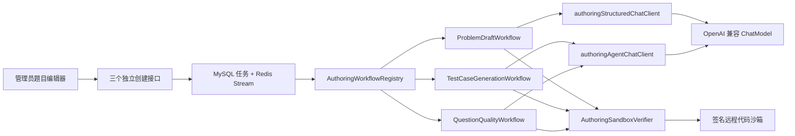
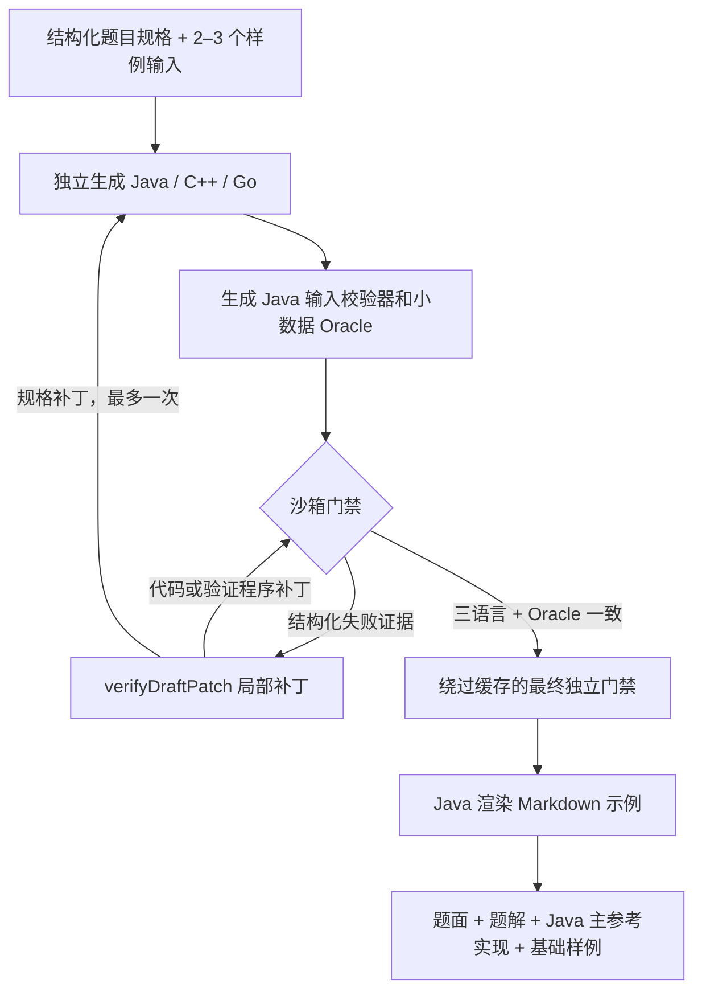
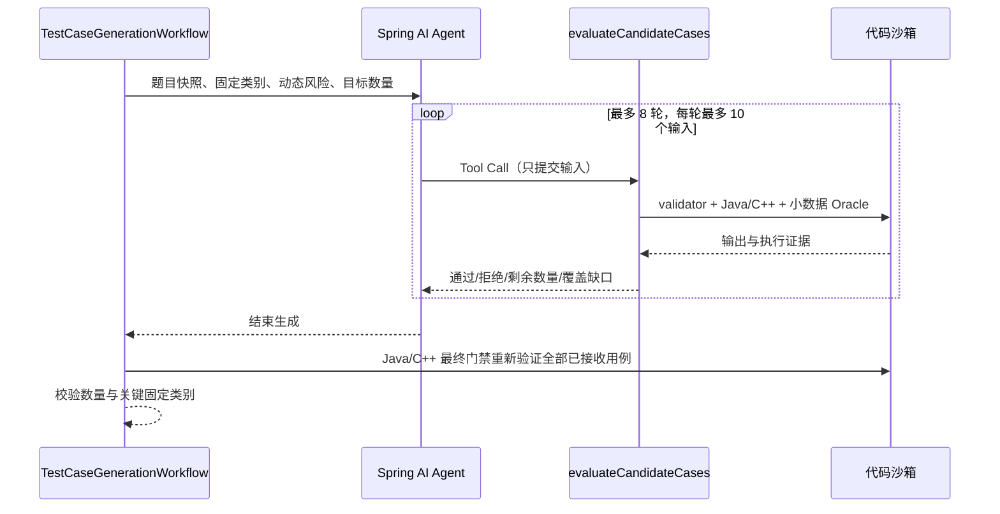
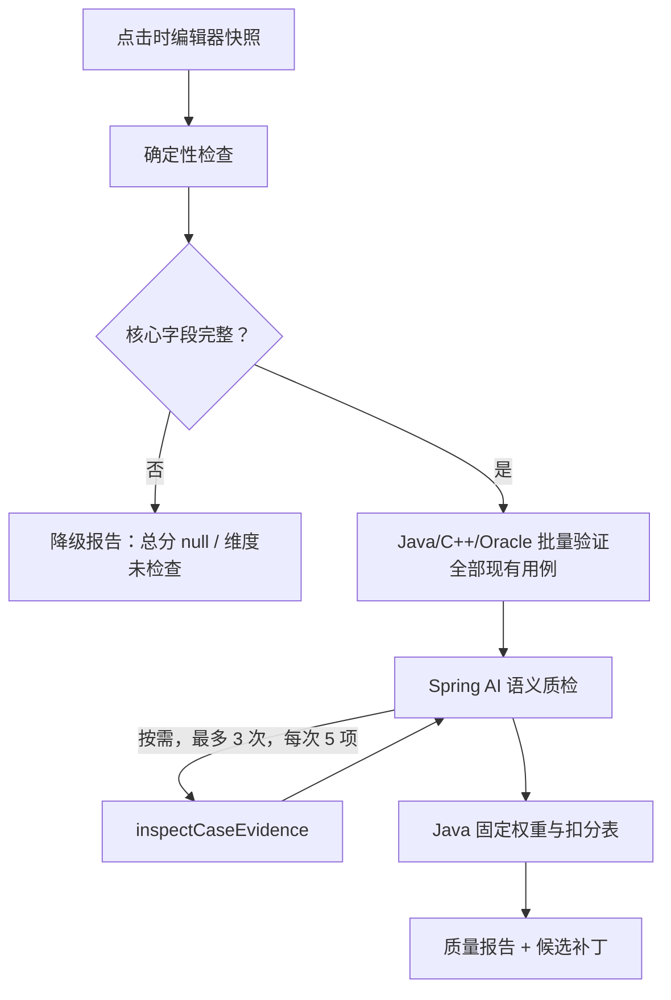

# Spring AI 题目创作工作流

## 模块边界

题目创作继续运行在现有 AI Service 内。MySQL 任务表、Redis Stream、消费者、幂等、重试、取消与恢复是共享的浅层基础设施；任务被领取后，`AuthoringWorkflowRegistry` 按 `AuthoringTaskType` 把请求交给三个互不调用的深模块。



公共接口只暴露稳定的工作流协议：

```java
interface AuthoringWorkflow<I extends AuthoringRequest, A extends AuthoringArtifact> {
    AuthoringTaskType type();
    Class<I> requestType();
    A execute(WorkflowContext context, I request);
}
```

`WorkflowContext` 封装任务 ID、任务类型、取消信号、阶段进度、执行预算、MySQL 阶段断点、工具摘要和 Micrometer 标签。注册表启动时拒绝同类型重复实现，运行时拒绝未知类型和错误请求类型。

## 三条工作流

### 创建题目 `PROBLEM_DRAFT`



初次验证失败后，Spring AI Agent 必须调用 `verifyDraftPatch`；每次最多三个白名单替换，整个任务最多三次工具调用。代码补丁只重跑哈希变化的产物，规格补丁会清空三语言解、validator、Oracle 和该任务的执行缓存，再由 Java 工作流重新生成。最终门禁始终绕过缓存。修复耗尽时任务失败并保留断点，不返回未验证草稿。产物只包含基础样例，不生成完整隐藏测试集。

### 共享沙箱验证模块

`AuthoringSandboxVerifier` 是三个工作流共同使用的深模块。调用方只选择 `DRAFT_REPAIR`、`DRAFT_FINAL_GATE`、`CASE_ACCEPTANCE`、`CASE_FINAL_GATE` 或 `QUALITY_BASELINE`；实现内部统一处理签名请求、并发租约、熔断、逐用例诊断、validator、多语言和 Oracle 比较。CE、RE、TLE、MLE、OLE 与一致性问题返回结构化 `VerificationIssue`，沙箱不可用继续作为依赖异常触发原任务重试。

确定性执行按任务 ID、用途、语言、源码、输入和限制的 SHA-256 缓存，最多 1024 项、写入后 30 分钟过期；缓存不跨任务，基础设施失败不缓存，所有最终门禁绕过缓存。

### 生成用例 `TEST_CASES`



循环由 Spring AI `ToolCallAdvisor` 驱动，实际对话是“模型 → 工具 → 工具结果 → 模型”。工具掌握已验收集合，负责格式、大小、去重、数量、双解和 Oracle 验证；模型不能自行声明达标。结果只含 `JudgeCase`、覆盖报告、验证摘要和工具轨迹。前端应用前重新计算题目快照 SHA-256，不一致时必须重新生成。

### AI 质检 `QUALITY_REVIEW`



模型只提交结构化问题、严重级别、证据引用和白名单字段建议。Java 固定计算五个维度分数；有 `BLOCKER` 时总分最高 59，任一核心维度未检查时总分为 `null`。

补丁只允许替换白名单字段、整段已验证答案、修正三方一致的期望输出和删除完全重复用例。补丁不能新增输入或修改已有输入。前端先展示报告，管理员主动进入补丁页后逐条勾选；默认全不选。应用只修改本地编辑器，不调用保存或发布接口，并通过 `beforeHash` 或 `caseInputHash + caseOutputHash` 执行字段级乐观校验，避免用例数组索引漂移后误改其他输入。

## Spring AI Client 隔离

| Client | Advisor | 温度 | 用途 |
|---|---|---:|---|
| `aiChatClient` | RAG + `ToolCallAdvisor` | 原提交复盘配置 | 提交反馈，保持原链路 |
| `authoringStructuredChatClient` | 无 | 默认 0.15；题目规格 0.45 | 题目规格、代码、验证程序、覆盖计划 |
| `authoringAgentChatClient` | 仅 `ToolCallAdvisor` | 0.10 | 草稿修复、用例 Agent、质检 Agent |

题目创作 Client 不配置 `RetrievalAugmentationAdvisor`，不访问向量库。任务结果只保存工具轮次、数量、耗时和终止原因，不保存完整模型对话。

## 任务、断点与结果

任务结果是判别联合信封：

```json
{
  "taskId": "1",
  "taskType": "QUALITY_REVIEW",
  "status": "REVIEW_REQUIRED",
  "stage": "COMPLETED",
  "progress": 100,
  "result": {
    "type": "QUALITY_REVIEW",
    "schemaVersion": 1,
    "data": {}
  }
}
```

`workflowStateJson` 保存断点结构版本、Prompt 版本、已完成阶段、必要中间产物和工具摘要。阶段状态与进度原子更新。成功任务在写入结果时清理大对象；失败和超时任务保留断点。手动重试、实例中断恢复会在版本兼容时续跑；Prompt 或断点版本变化时清空断点全量重跑。草稿修复协议使用 Prompt 版本 `v4`。

默认预算为创建题目 12 分钟、生成用例 18 分钟、质检 15 分钟；并发 2、最多 3 次任务尝试，僵尸恢复阈值 23 分钟。

## 管理员 API

```text
POST /api/ai/generation/tasks/problem-drafts
POST /api/ai/generation/tasks/test-cases
POST /api/ai/generation/tasks/quality-reviews

GET  /api/ai/generation/tasks/{taskId}
GET  /api/ai/generation/tasks?current=1&pageSize=10&type=TEST_CASES
POST /api/ai/generation/tasks/{taskId}/retry
POST /api/ai/generation/tasks/{taskId}/cancel
```

三个创建接口都要求 `X-Idempotency-Key`。旧通用 `POST /generation/tasks` 已移除。数据库升级执行 `sql/migration_20260814_ai_authoring_workflows.sql`，它会把 `FULL_PROBLEM` 改为 `PROBLEM_DRAFT`、包装旧结果并增加断点列。

## 可观测性与测试

Micrometer 指标按任务类型、结果、阶段、工具名、轮次、通过数、拒绝数、验证用途、错误码、缓存命中、重试原因和断点操作打标签。Spring AI observation 不记录 Prompt、Completion、源码、输入或完整 stderr。

关键离线测试覆盖：注册表唯一性、三语言基础样例、真实 `ToolCallAdvisor` 多轮协议、工具 8/3 轮预算、批次上限、沙箱双解与 Oracle 不一致、Java 最终门禁、降级质检、固定评分、快照过期、补丁默认不选与字段冲突。提交反馈链路测试继续验证原有 RAG 和 Submission Tools。
