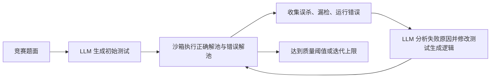

# OJ 与编程测评平台的 AI 功能版图：对 MyOJ 的选型建议

> 调研日期：2026-08-13  
> 调研问题：市面上的 OJ、编程学习和技术测评平台如何加入 AI；是否已有“AI 生成测试 -> 沙箱执行 -> 错误解/变异验证 -> 迭代补强 -> 人工审批”的实现。  
> 资料口径：只采用产品官方文档、官方工程博客、官方开源仓库和论文原文。商业产品无法查看内部代码时，只陈述公开可验证的产品能力，不把宣传文案推断为技术实现。

## 1. 结论先行

1. **主流商业平台加入 AI 的方式，仍以四类为主**：考生/学习者 Copilot、AI 面试官、AI 辅助出题、反作弊与 AI 使用能力评价。CodeSignal、HackerRank 和 LeetCode 的公开资料都能验证这些方向，但公开资料没有证明它们把“变异测试驱动的题目验收闭环”作为管理员产品提供。
2. **成熟开源竞赛 OJ 的判题主干仍是确定性的，但 HUSTOJ 已经开始在外围产品功能中接入 AI**。它的官方更新日志可以核验到 AI 答疑、编译/运行错误解释、比赛 AI 开关、辅助造题、造数据与标程、题目标签生成，以及异步模型调用；这些功能仍未公开形成“沙箱执行 + 错误解池/变异 + 自动补强”的验题闭环。DMOJ、Hydro、DOMjudge 的官方主功能仍集中于沙箱、checker、test data、比赛和权限；Judge0 可成为 Agent 的执行后端，但自身不是 AI 题目验收 Agent。[DMOJ](https://github.com/DMOJ/online-judge)、[Hydro](https://github.com/hydro-dev/Hydro)、[HUSTOJ](https://github.com/zhblue/hustoj)、[DOMjudge](https://github.com/DOMjudge/domjudge)、[Judge0](https://github.com/judge0/judge0)
3. **此前给 MyOJ 提出的闭环不是臆想，已有很强的一手依据**。最接近 OJ 场景的是 CodeContests-O：LLM 生成测试，沙箱跑已知正确/错误解，将误判结果反馈给 LLM，再迭代补强测试；最接近“变异实现 + 定向补测”的工业案例是 Meta ACH：LLM 生成目标故障的 mutants，再生成能杀死这些 mutants 的测试。[CodeContests-O 论文](https://arxiv.org/abs/2601.13682)、[开源仓库](https://github.com/cai-jianfeng/CodeContests-O)、[Meta ACH 官方工程文](https://engineering.fb.com/2025/09/30/security/llms-are-the-key-to-mutation-testing-and-better-compliance/)
4. **已经出现接近产品化的开源先例，但仍没有找到传统竞赛 OJ 的同构实现**。Artemis Hyperion 已用 Spring AI 为 Java 编程练习生成题面、模板、参考解和测试，并通过仓库、CI build、diff 与人工 review 控制发布；但它是课程/软件工程作业平台，不是 stdin/stdout 竞赛 OJ，也没有公开证明使用错误解池或 mutation score 做自动补强。[Artemis 编程题官方文档](https://docs.artemis.tum.de/instructor/exercises/programming-exercise/)、[Hyperion 管理文档](https://docs.artemis.tum.de/admin/hyperion/)
5. **建议把 MyOJ 的第一版定义为“AI 题目验收流水线”，而不是“AI 自动出题器”**。AI 只提出策略和候选数据；格式校验、参考解执行、正确/错误解判别、mutation score、预算和审批全部由确定性系统控制。

## 2. 市面上的产品通常怎样加入 AI

### 2.1 CodeSignal：把 AI 变成受控 Copilot 和可观察的考核对象

CodeSignal 的 Cosmo 嵌入评测 IDE，可选择偏协作的 Copilot 模式或只提供轻量帮助的 Guided Support 模式；评测结束后，企业可以看到候选人与 AI 的完整对话和 session replay。[CodeSignal 官方介绍](https://codesignal.com/blog/introducing-ai-assisted-coding-assessments-interviews/)、[Cosmo 使用文档](https://support.codesignal.com/hc/en-us/articles/16957386089879-Evaluate-test-takers-AI-skills-with-Cosmo)

2026 年的官方更新进一步把方向扩展到：

- 候选人使用 Claude Code、Cursor 或 Codex 完成基于仓库的 agentic coding assessment；
- Cosmo 帮企业用户发现合适的 assessment，并通过对话代办创建流程；
- Cosmo 能生成 Conversation、Whiteboard、Matrix、Quiz、Writing 等类型的问题，生成后由用户修改并保存。[2026 年 3 月产品更新](https://support.codesignal.com/hc/en-us/articles/39883270333591-Product-Updates-March-2026)、[自定义问题文档](https://support.codesignal.com/hc/en-us/articles/39487797928727-Create-Custom-Questions-with-Cosmo)

需要明确：CodeSignal 公开文档能证明“AI 辅助答题、记录交互、辅助选题与生成部分题型”，**不能证明**它使用 mutation testing 自动强化隐藏用例。

### 2.2 HackerRank：AI 辅助、AI 面试、AI 能力题和评测完整性并行

HackerRank 的公开产品能力覆盖得更广：

- AI-Assisted Tests 在 coding、database、data science 和 project 类问题中提供 Guarded/Unguarded 两种助手模式。[官方文档](https://support.hackerrank.com/articles/1152916770-ai-assisted-tests)
- Chakra AI interviewer 可动态追问、评价回答并形成带依据的报告；官方同时强调人类复核仍是流程的一部分。[官方实践指南](https://www.hackerrank.com/blog/how-to-build-a-technical-interview-process-for-the-agentic-era/)
- Prompt Engineering 题通过预配置测试用例对模型输出做严格匹配；Generative AI/RAG 项目题可以在浏览器环境中运行，并使用 JUnit/TAP 等测试输出自动评分，也可人工评分。[Prompt Engineering 题](https://support.hackerrank.com/articles/6081633644)、[Generative AI 题](https://support.hackerrank.com/articles/7355446816-creating-a-rag-retrieval-augmented-generation-question)
- AI Solvability Indicator 会按月用 AI 模拟题库问题的可解性，供企业过滤容易被 AI 解决的问题；AI-powered plagiarism detection 和 proctoring 则服务于评测完整性。[AI Solvability 官方文档](https://support.hackerrank.com/articles/7394210877-ai-solvability-indicator-and-filter)、[评测完整性说明](https://www.hackerrank.com/blog/our-commitment-to-assessment-integrity/)

这说明商业平台已经从“禁止 AI”转向“允许、约束、记录并评价候选人如何使用 AI”。但 HackerRank 公开的 Question Quality Review 仍主要检查测试数量、样例、代码桩和标签等规则，不是基于 mutation score 的自动验题。[Question Quality Review](https://support.hackerrank.com/articles/4691012356-review-question-quality)

### 2.3 LeetCode：用户侧解题与调试 Agent

LeetCode 官方活动公告将 Ask Leet 描述为用于 solution 和 debugging 的 AI agent，并与自动补全、调试器和 judge 等能力一起放在 Premium 权益中。[LeetCode 官方公告](https://leetcode.com/discuss/post/7363823/)

公开信息足以证明它在做用户侧的解题/调试助手，但不足以核验 Ask Leet 的工具链、是否实际重跑代码、是否 RAG，也不足以证明其题库后台使用 AI 变异测试。因此这里不对内部架构做猜测。

### 2.4 商业市场的共同模式

综合上述官方资料，商业平台当前更重视：

```text
候选人/学习者侧：上下文 Copilot、提示、调试、个性化学习
招聘方侧：AI 面试、报告摘要、AI fluency、交互回放
内容侧：题目发现、题目草稿、AI-solvable 分析
治理侧：反作弊、审计、人类最终决策
```

它们很少公开“如何生成和验证隐藏判题数据”。一方面这是核心题库资产，另一方面公开文档通常只描述功能，而不披露 agent loop、模型、数据和停止条件。因此对商业产品只能做产品能力比较，不能把营销声明当成实现证据。

## 3. 开源 OJ 的现状：AI 通常不是核心的一部分

| 项目 | 官方可验证的主能力 | AI 现状判断 |
| --- | --- | --- |
| [DMOJ](https://github.com/DMOJ/online-judge) | 60+ 语言、交互题、signature grader、运行时数据生成器、自定义 validator、分布式 judge、比赛与题解 | 官方功能清单没有内置 LLM/AI 辅导或 AI 验题；适合作为“生产 OJ 应保留确定性判题边界”的参考。 |
| [Hydro](https://github.com/hydro-dev/Hydro) | 插件化、多空间、权限、弹性评测、多题型、Special Judge、数据导入和 VJudge | 插件机制适合外挂 AI，但官方仓库主功能仍是 OJ；本次没有核验到官方内置的通用 AI Agent。 |
| [HUSTOJ](https://github.com/zhblue/hustoj) | PHP/C++/MySQL/Linux 的传统 ACM/NOIP OJ；官方更新日志还包含 AI 答疑、错误解释、辅助造题、造数据/标程、标签与异步调用 | 已将 AI 接入多个真实页面和运营流程，但公开资料未显示它用真实执行、错误解池或 mutation score 验证 AI 产物。 |
| [DOMjudge](https://github.com/DOMjudge/domjudge) | ICPC/IOI 风格比赛、jury/judgehost、validator 和赛事运维 | 目标是比赛裁判系统，不是 AI 教学或题目生成系统。 |
| [Judge0](https://github.com/judge0/judge0) | 可自部署、90+ 语言、沙箱、多文件执行、资源限制、webhook、HTTP API | 官方明确其可执行 AI 生成代码、可作为 AI Agent 的执行后端；但它只提供执行原语，不提供规划、测试补强或审批。 |

这里的结论是**范围内核验结论，不是对 GitHub 所有 OJ 的绝对断言**。确实存在许多把 “AI-powered” 写在 README 中的 OJ 课程项目，但如果没有可检查的执行闭环、状态持久化、权限、评估数据或真实用户证据，不应把它们当成成熟参考。

HUSTOJ 值得单独作为国内工程参照。其官方更新日志显示，它从模型 API 适配和 AI 答疑开始，逐步增加编译/运行错误解释、比赛 AI 开关、AI 造数据和标程、鼠标式辅助造题、异步调用与题目标签生成。这条路线的优势是功能多、接入快、容易让用户感知；局限是公开资料没有说明生成的数据和标程会经过参考解回放、错误解对抗、mutation score 或审批版本管理。因此它更像“把 AI 分散嵌入 OJ 功能”，而不是“以可量化证据保证题目质量”。[HUSTOJ 官方仓库与更新日志](https://github.com/zhblue/hustoj)

## 4. 与 MyOJ 设想最接近的开源平台与 OJ/竞赛研究

### 4.1 Artemis Hyperion：已经落进开源评测平台的 Spring AI 出题链路

Artemis 是开源交互式学习和自动评测平台。其 Hyperion 模块直接集成在编程题编辑器中，并由 Artemis 与 Spring AI 实现，无需额外 EduTelligence 服务。官方文档能验证以下完整行为：[编程题 instructor 文档](https://docs.artemis.tum.de/instructor/exercises/programming-exercise/)、[Hyperion 管理文档](https://docs.artemis.tum.de/admin/hyperion/)、[Artemis 官方仓库](https://github.com/ls1intum/Artemis)

- 从自然语言 requirements 生成带 test case task annotations 的 Markdown 题面；
- 对整份或选中片段进行迭代重写，并在 diff view 中让教师审阅；
- 当前为 Java 编程练习生成 Template、Solution、Test 三类 repository；
- 生成上下文包含题面、现有仓库结构、build environment 和已知 consistency issues；
- 生成文件会写入仓库、commit，并通过配置好的 CI 构建；
- 教师可把 repository review thread 标记为 `Apply with AI`，在下一次生成中提供定向人工反馈；
- 官方明确要求把生成结果视作 draft，检查代码和 build 结果后再发布给学生。

这是本次调研中最接近 MyOJ “真正产品功能”的开源参考，而且与 MyOJ 计划使用 Spring AI 的技术栈直接相关。它验证了：**AI 生成题面/参考解/测试 + CI 验证 + 人工 review** 可以做进成熟评测平台，而不是只能停留在离线脚本。

它仍缺少 MyOJ 想要的最后一段：官方资料没有说明 Hyperion 会构造错误解池、计算 TPR/TNR 或 mutation score、再根据存活错误实现自动补强 tests。因此 MyOJ 的差异化不是“也能 AI 生成测试”，而是“用真实 AC/WA 和 mutants 证明测试有判别力”。

Artemis 生态中的 Iris 则代表学生侧 AI 功能：它读取当前练习、学生代码、build logs、test results 和课程材料，提供分层提示；课程材料通过 RAG 检索并附引用。[Iris 官方说明](https://ls1intum.github.io/edutelligence/iris/docs/overview/what-is-iris/)、[学生使用文档](https://ls1intum.github.io/edutelligence/iris/docs/student/getting-started/)、[开源 monorepo](https://github.com/ls1intum/edutelligence)

因此 Artemis 已经把 AI 分成了两个业务边界清晰的模块：

```text
Hyperion：面向教师，辅助创建和检查练习 artefacts
Iris：面向学生，基于代码、build 和课程材料做教学提示
```

这比在同一个聊天框中同时做出题、判题和辅导更值得 MyOJ 参考。

### 4.2 CodeContests-O：几乎同构的“测试生成—执行—反馈—迭代”闭环

CodeContests-O 的流程是：



论文摘要明确写出：先让 LLM 生成测试，在已知正确和错误解上执行，再把失败结果作为反馈，引导 LLM 改进测试的 fidelity 和 discriminability。作者对约 `1.1 × 10^7` 个 solution 执行结果评估，报告平均 TPR 89.37%、TNR 90.89%，并开放了代码和数据。[论文](https://arxiv.org/abs/2601.13682)、[代码](https://github.com/cai-jianfeng/CodeContests-O)

它与 MyOJ 方案的主要差异是：

- 它用于离线构建训练/评测数据集，而不是 OJ 管理员的在线工作流；
- 它主要利用已有正确/错误 solution pools，而不是只依赖自动 mutation；
- 它没有 MyOJ 所需的管理员审批、题目版本、正式 judgeCase 发布和业务权限。

但这反而给 MyOJ 一个更实用的优先级：**先复用站内历史 AC/WA 提交作为真实对抗样本；样本不足时再生成确定性 mutants。** 真实 WA 往往比 LLM 凭空编写的“错误实现”更自然。

### 4.3 CodeContests+：Generator、Validator、Checker 分工

CodeContests+ 是面向竞赛编程测试数据生成的 LLM Agent 系统。论文使用 172 万条带 pass/fail 标签的 submission 评估测试质量，说明测试生成不能只看“能否让参考解通过”，还要分别测量接受正确解和拒绝错误解的能力。[论文](https://arxiv.org/abs/2506.05817)

其设计对 MyOJ 最有价值的不是“多 Agent”本身，而是职责分离：

- Generator 生成随机、边界和 tricky case；
- Validator 检查输入是否满足题意约束，并把非法原因反馈给 Generator；
- Checker 负责非唯一答案等问题的判定；
- 沙箱是真实执行与质量度量的事实来源。

因此 MyOJ 不应只让模型直接吐 `{input, output}`。更可靠的产物是：**输入生成器 + 输入 validator + 必要时的 checker 草稿**，然后由参考解计算 expected output。

### 4.4 EvalPlus：生成更多测试，验证原始测试集确实会漏错

EvalPlus 结合 LLM 和 mutation-based input generation 扩展 HumanEval/MBPP 的测试；官方论文报告 HumanEval+ 的测试数量约为原始集的 80 倍，并发现原基准会放过不少错误代码，导致模型 pass@k 被高估。[论文](https://proceedings.neurips.cc/paper_files/paper/2023/hash/43e9d647ccd3e4b7b5baab53f0368686-Abstract.html)、[官方仓库](https://github.com/evalplus/evalplus)

它不是 OJ 产品，也不是多轮题目审核 Agent，但验证了一个核心观点：**“参考解通过现有测试”不代表测试集有足够判别力；必须用错误实现或变异来审计测试集。**

## 5. 与“变异驱动补强”最接近的工业与开源系统

### 5.1 Meta ACH：工业级“生成 mutants，再生成杀死它们的测试”

Meta 官方将 ACH 定义为 mutation-guided、LLM-based test generation 系统。工程师用自然语言描述关注的故障，ACH 生成与该关注点相关的 mutants，再生成能捕获这些故障的测试；官方称已用于 Facebook Feed、Instagram、Messenger 和 WhatsApp。[Meta 官方工程文](https://engineering.fb.com/2025/09/30/security/llms-are-the-key-to-mutation-testing-and-better-compliance/)、[论文](https://arxiv.org/abs/2501.12862)

这是对 MyOJ “典型错误实现 -> 沙箱执行 -> 生成区分用例”最直接的工业背书。需要如实注明：ACH 是 Meta 内部工业系统和论文成果，本次没有找到可复用的完整开源产品，且它处理的是代码库单元测试，不是 stdin/stdout OJ 题。

### 5.2 Meta TestGen-LLM：AI 产物必须通过确定性过滤和人工接受

TestGen-LLM 增强已有人工测试，并依次用确定性过滤器验证生成测试能 build、能稳定通过、能提高覆盖率。论文报告在 Instagram Reels/Stories 数据上，75% 生成测试能构建，57% 能可靠通过，25% 能增加覆盖；在 Instagram/Facebook test-a-thon 中，工程师接受了 73% 的推荐用于生产部署。[FSE 2024 论文](https://arxiv.org/abs/2402.09171)

这些数字也暴露了关键事实：即使是强模型和工业上下文，生成内容也有大量在 build、稳定性和增益过滤阶段被淘汰。MyOJ 因此不能让模型直接写正式隐藏用例，必须经过执行验证并进入待审批草稿。

### 5.3 MuTAP：把 surviving mutants 重新送回提示词

MuTAP 先生成测试并修正语法/行为问题，再运行 mutation testing，将仍存活的 mutants 加入 prompt，驱动 LLM 定向生成更有效的测试。论文报告合成 buggy code 上平均 mutation score 为 93.57%，并比对照方法多检测最多 28% 的人工错误代码片段。[论文摘要与方法](https://arxiv.org/abs/2308.16557)

MuTAP 与 MyOJ 的“补强循环”高度相似，但原始研究是 Python program-under-test 的单元测试生成，不包含 OJ 题目格式、资源上限、题目发布和管理员权限。

### 5.4 CodaMOSA：只有覆盖率停滞时才调用 LLM

CodaMOSA 把 LLM 接入基于搜索的 Pynguin 测试生成器：传统搜索遇到 coverage plateau 时，才调用模型生成新测试，再回到搜索过程。官方仓库直接给出了 plateau tracking、模型调用和生成代码规范化等实现。[Microsoft 官方仓库](https://github.com/microsoft/codamosa)、[ICSE 2023 论文](https://www.microsoft.com/en-us/research/uploads/prod/2023/03/codamosa_icse23.pdf)

对 MyOJ 的启发是：AI 不必承担所有生成工作。普通边界、随机数据和确定性 mutation 可以先跑，只有发现长期存活变异或判别率停滞时，才调用模型，从而降低成本和不确定性。

### 5.5 ChatUniTest 与 Qodo Cover：可复用的生成—验证—修复工程模式

ChatUniTest 对 Java 单元测试采用 generation-validation-repair 机制，并公开 Maven plugin；配置支持最大修复轮数，仓库还集成/复现了 MuTAP 等多种策略。[论文](https://arxiv.org/abs/2305.04764)、[官方仓库](https://github.com/ZJU-ACES-ISE/ChatUniTest)、[Maven plugin](https://github.com/ZJU-ACES-ISE/chatunitest-maven-plugin)

Qodo Cover（原 Cover-Agent）接收源文件、已有测试、coverage report 和实际 test command，按 `desired-coverage` 与 `max-iterations` 循环生成并执行测试。官方仓库也明确列出 Test Runner、Coverage Parser、Prompt Builder、AI Caller 四个组件。[官方仓库](https://github.com/qodo-ai/qodo-cover)

Qodo Cover 是很好的代码参考，但须注意：

- 它优化的是代码覆盖率，不是 OJ 对正确/错误解的判别率；
- 仓库自 2025-06-15 起标记为不再维护；
- README roadmap 中未勾选的 flakiness 等条目是计划，不应当成已实现能力。

### 5.6 CoverUp 与 TestSpark：执行验证后才向人展示测试

UMass PLASMA 实验室的 CoverUp 会先测现有 pytest coverage，选择未覆盖区域，与 LLM 对话生成测试，实际运行并验证测试可执行且能增加 coverage；失败或无增益时会再次提示模型修正。它还会多次运行候选测试检测 flakiness，并建议在 Docker 中执行生成测试。[CoverUp 官方仓库](https://github.com/plasma-umass/coverup)、[FSE 2025 replication package](https://github.com/plasma-umass/coverup-eval)

JetBrains Research 的 TestSpark 是 IntelliJ 插件，同时集成 LLM、EvoSuite 搜索生成和 Kex 符号执行。其 LLM 路径会在向用户展示前自动检查测试有效性；EvoSuite 路径则支持 line/branch/I/O diversity/exception/mutation score 等目标。官方明确声明它是研究工具，生成测试用于增强而不是替代人工测试。[TestSpark 官方仓库](https://github.com/JetBrains-Research/TestSpark)、[JetBrains Research 官方介绍](https://blog.jetbrains.com/research/2025/09/testspark-unit-test-generation)、[ICSE 论文](https://arxiv.org/abs/2401.06580)

两者说明“多技术组合”比“一个万能 LLM Agent”更符合工程现实：LLM 提高可读性和意图理解，搜索/符号执行补覆盖，真实 test runner 过滤幻觉，IDE/代码评审保留人工选择。

### 5.7 AdverTest：两个 Agent 对抗共演化的研究前沿

AdverTest 设置 Test Agent 与 Mutant Agent：Mutant Agent 持续生成能逃过当前测试集的 mutants，Test Agent 再补充测试去杀死这些 mutants，循环同时受 coverage 和 mutation score 引导。论文在 Defects4J 上报告相对最佳 LLM-based 方法提高 8.56% fault detection，相对 EvoSuite 提高 63.30%。[论文原文](https://arxiv.org/abs/2602.08146)

它和此前构想的“错误实现仍能通过 -> AI 生成区分用例 -> 再执行”几乎完全同构，但必须标成**研究方案**：本次未找到稳定的正式公开仓库入口，论文发布时间也很新，不能把它描述成已在 OJ 或工业生产中部署。

## 6. 横向比较

符号：`✓` 为一手资料明确验证；`部分` 表示只有其中一段；`未证实` 表示公开资料不足，不能据此宣称。

| 系统 | 产品位置 | AI 生成测试 | 真实执行反馈 | 错误解/变异驱动 | 多轮补强 | 人工闸门 | 证据强度 |
| --- | --- | ---: | ---: | ---: | ---: | ---: | --- |
| CodeSignal Cosmo | 商业测评/学习 | 部分，生成部分题型 | 评测本身有 judge，但未证实用于出题闭环 | 未证实 | 未证实 | ✓，企业可审阅 | 官方产品文档，内部实现不可见 |
| HackerRank | 商业测评 | 部分，AI/内容辅助 | ✓，项目和 coding 题按 tests 评分 | AI-solvability 属相邻能力，mutation 未证实 | 未证实 | ✓，支持人工评分/复核 | 官方产品文档，内部实现不可见 |
| LeetCode Ask Leet | 商业练习 OJ | 未证实 | 平台有 judge，Agent 是否调用未证实 | 未证实 | 未证实 | 用户自己决策 | 官方功能公告，技术细节少 |
| DMOJ/Hydro/DOMjudge | 开源 OJ | 否 | ✓ | 否 | 否 | 题目管理员人工 | 官方仓库，可核验代码 |
| HUSTOJ | 开源 OJ | 部分，造题/数据/标程 | 未证实 AI 产物进入执行反馈闭环 | 未证实 | 未证实 | 管理员功能 | 官方更新日志可核验 AI 功能，但非验题闭环 |
| Judge0 | 开源执行引擎 | 否 | ✓ | 否 | 否 | 不负责 | 官方仓库，可作为工具层 |
| Artemis Hyperion | 开源教学评测平台 | ✓，题面/模板/解法/tests | ✓，repository + CI build | 未证实 | ✓，可带 review feedback 再生成 | ✓，diff/review 后发布 | 官方产品文档 + 开源仓库；最接近产品化 |
| Artemis Iris | 开源 AI tutor | 否 | 读取已有 build/test evidence | 否 | 对话式提示 | 教师控制/学生可 opt out | 官方文档 + 开源服务 |
| CodeContests+ | 研究/开源竞赛数据生成 | ✓ | ✓ | 使用真实 pass/fail submissions 评估 | ✓，Validator 反馈 | 数据集流程，不是在线审批 | 论文；非通用 OJ 产品 |
| CodeContests-O | 研究/开源竞赛数据生成 | ✓ | ✓ | ✓，正确/错误 solution pools | ✓ | 数据集流程，不是在线审批 | 论文 + 代码，和 MyOJ 最接近 |
| Meta ACH | 工业软件测试 | ✓ | ✓ | ✓，LLM mutants | ✓ | 工程师定义关注点并消费结果 | 官方工程文 + 论文，代码未开放 |
| Meta TestGen-LLM | 工业软件测试 | ✓ | ✓ | 否，主要按 build/pass/coverage 过滤 | 部分 | ✓，工程师接受后进生产 | 工业部署论文 |
| MuTAP | 研究型测试生成 | ✓ | ✓ | ✓，surviving mutants | ✓ | 否 | 论文/复现代码，不是 OJ |
| CodaMOSA | 开源测试生成 | ✓ | ✓ | 否，coverage-guided search | ✓ | 否 | 微软官方仓库 + 论文 |
| ChatUniTest | 开源 Java 测试生成 | ✓ | ✓，编译/测试修复 | 可运行 MuTAP 策略 | ✓ | 开发者接收文件 | 论文 + Maven plugin |
| Qodo Cover | 开源测试生成 | ✓ | ✓，test command + coverage | 否 | ✓ | 可进入代码评审流程 | 官方仓库，但已停止维护 |
| CoverUp | 开源 Python 测试生成 | ✓ | ✓，pytest/coverage/flaky 检查 | 否 | ✓ | 开发者接收文件 | 官方仓库 + FSE artifact |
| TestSpark | 开源 IDE 插件 | ✓ | ✓，展示前校验 | EvoSuite 路径支持 mutation score | 部分 | ✓，用户在 IDE 中选择 | JetBrains 官方仓库；声明为研究工具 |
| AdverTest | 研究型对抗测试生成 | ✓ | ✓ | ✓，Mutant Agent | ✓，双 Agent 共演化 | 否 | 2026 论文；未证实生产部署 |

## 7. 对 MyOJ 的直接启示

### 7.1 功能定位应比“AI 出题”更窄、更可信

推荐命名：**AI 题目验收与判题数据强化**。

它不负责从零生产并直接发布整道题，而负责回答一个可验证的业务问题：

> 当前题面、参考解和隐藏测试，能否稳定接受正确实现、拒绝典型错误实现，并覆盖边界与资源风险？

这个定义能自然形成线上闭环，也让 AI 与现有 Question Service、Judge Service、沙箱和管理员页面真正结合。

### 7.2 首版优先使用“确定性 mutation + 受控提交池”

候选对抗实现的优先级建议是：

1. 参考解和管理员提供的可信正确解作为正样本；
2. 对参考解做确定性 AST mutation，例如 `<`/`<=`、边界偏移、`int`/`long`、排序方向、状态清理、复杂度退化；
3. 管理员提供的典型错误解作为负样本；
4. 只有在用途授权、去标识化和数据最小化到位后，才引入站内历史 AC/WA/TLE/RE；代码优先只在本地沙箱执行，不把原始用户代码发送给第三方模型；
5. 最后才让 LLM 生成少量“典型错误实现”，且必须先编译、运行、去重和分类。

这与 CodeContests-O 使用正确/错误解池，以及 Meta ACH 使用定向 mutants 的思路一致，同时比“让模型一次生成 12 份错误代码”更可控。真实提交可以提高样本自然度，但不应为了效果绕过隐私、授权和代码资产边界。

### 7.3 质量指标不能只用 coverage

至少记录：

```text
TPR = 正确解被测试集接受的比例
TNR = 错误解被测试集拒绝的比例
Mutation Score = 被测试集杀死的非等价变异 / 全部非等价变异
Invalid Case Rate = 格式或约束不合法的 AI 用例比例
Reference Stability = 参考解多次执行稳定通过比例
Human Acceptance Rate = 管理员最终采纳的候选用例比例
Cost per Accepted Case = 每个最终采纳用例的模型与沙箱成本
```

CodeContests-O/CodeContests+ 证明 TPR/TNR 适合衡量 OJ 测试的 fidelity/discriminability；Meta ACH 和 MuTAP 证明 mutation score 比单纯覆盖率更接近“能否发现错误”。

### 7.4 建议的线上状态机

```text
PENDING
  -> PLANNING
  -> GENERATING_CANDIDATES
  -> VALIDATING_INPUTS
  -> VERIFYING_REFERENCE
  -> EVALUATING_SOLUTION_POOL
  -> MUTATION_TESTING
  -> STRENGTHENING
  -> NEEDS_REVIEW
  -> APPROVED | REJECTED | FAILED | TIMEOUT
```

每个阶段保存 checkpoint、输入摘要、规则版本和预算消耗。模型调用失败不应回滚已经完成的确定性验证；系统重启后可以从上一个 checkpoint 恢复。

### 7.5 Human-in-the-loop 不是装饰

建议将 AI 生成用例保存到独立草稿版本：

- 展示该用例杀死了哪些真实 WA 或 mutants；
- 展示参考解输出摘要、耗时和内存；
- 展示输入约束校验结果和风险原因；
- 管理员逐条采纳/拒绝并填写原因；
- 审批后由确定性发布命令写入正式 `judgeCase`；
- 保留回滚版本和审计记录。

Meta TestGen-LLM 的部署数据说明“通过机器过滤”与“工程师愿意放入生产”是两层不同标准。MyOJ 应把管理员采纳率也当成 Agent 的离线评测信号。

## 8. 推荐实施范围

### MVP：有真实闭环，但控制复杂度

- 仅支持 Java、标准 stdin/stdout、唯一输出题；
- 管理员提供题面、约束、参考解和至少 2 个初始样例；
- LLM 生成结构化测试策略和输入生成器草稿；
- 确定性 validator 校验格式和约束；
- Judge Service 在无网络沙箱中执行参考解、历史 AC/WA 和 mutants；
- 最多 3 轮补强，每轮最多新增 10 个候选用例；
- 以 TPR/TNR、mutation score、预算或最大轮数作为停止条件；
- 产出可审计报告，管理员批准后才能发布。

### 第二阶段

- 引入随机生成器、metamorphic properties 和题目专属 checker；
- 用管理员采纳/拒绝原因优化 prompt 和规则；
- 对同题历史真实提交进行去标识化聚类，构建更自然的错误解池；
- 做离线 replay：固定模型、prompt、规则和沙箱镜像版本，比较每次升级的质量/成本。

### 暂不建议

- 直接让 AI 修改正式 `judgeCase`；
- 首版支持所有语言、交互题和 Special Judge；
- 用 LLM 代替输入 validator、checker 或 reference oracle；
- 只展示“生成了 20 个用例”而不展示杀死了哪些错误实现；
- 为了“充分使用框架”强行加入 RAG、多 Agent、长期记忆或向量库。

RAG 在这个功能中不是必需的。若以后积累了题目规范、出题手册、历史事故和 checker 模板，可以做规则/文档检索；但核心价值仍来自工具调用、沙箱反馈、可恢复工作流和量化评估。

## 9. 最终判断

这个方向值得做，而且比普通 RAG 错题助手更稀缺。最准确的表述不是“市面上没有”，而是：

> 商业编程测评平台已经大规模采用 AI 助手、AI 面试、AI 内容创作和反作弊；研究界与 Meta 工业系统已经验证了“LLM 生成测试 + 真实执行 + 错误解/变异反馈 + 迭代补强”的有效性。但成熟开源 OJ 尚少有把这条闭环产品化为管理员题目验收能力。MyOJ 可以把 CodeContests-O 的正确/错误提交池、Meta ACH/MuTAP 的变异驱动补测、TestGen-LLM 的确定性过滤与人工审批结合起来，形成一个有差异化、可量化、可上线的 AI 模块。

若最终完成 MVP，简历可如实概括为：

> 设计并实现基于 Spring AI 的 OJ 题目验收 Agent：通过结构化输出和受限 Tool Calling 编排输入校验、参考解执行、历史 AC/WA 回放与 AST 变异测试，根据沙箱反馈迭代补强判题用例；采用 Redis Stream + MySQL checkpoint 支持长任务恢复，以 TPR/TNR、Mutation Score 和管理员采纳率量化测试集质量，并通过人工审批、执行预算、版本化草稿和审计日志隔离 AI 风险。
