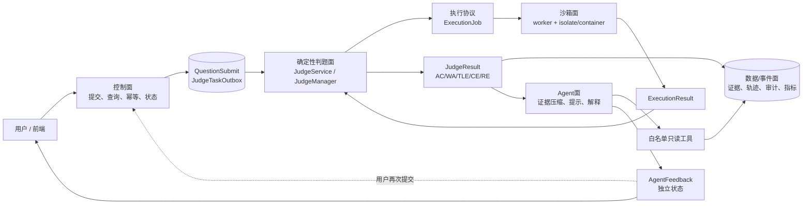

# Java OJ + LLM Agent：参考真实项目源码的架构研究

> 研究日期：2026-08-10  
> 研究范围：Judge0、OpenHands、SWE-agent、Zero2Leetcode、LangGraph4j（含 JDK8 分支），以及 FSE 2026 OJ feedback compression、UOJ-Bench、CodeArena 等一手资料。  
> 资料原则：先看官方仓库 README、源码目录、配置、API 文档和论文；论文只用于提炼架构启发，不把论文当成可直接依赖。  
> 结论性质：标记为“源码事实”的内容来自项目一手资料；“对 myoj 的建议”是基于这些事实和当前仓库代码的架构推断。

## 0. 结论先行

这轮研究得到的核心判断不是“再选一个 Agent 框架”，而是把五类责任拆开：

1. **控制面**负责提交接收、幂等、排队、状态迁移、重试和对外查询；
2. **确定性判题面**负责编译、运行、逐用例比对、资源判定和最终 AC/WA；
3. **Agent 面**只负责读取题目/提交/判题证据、压缩反馈、生成提示或建议，不能写入确定性 verdict；
4. **沙箱面**是独立的代码执行边界，不能被 LLM 直接替换成宿主机 shell；
5. **数据/事件面**保存提交快照、判题结果、Agent 轨迹、提示版本、模型版本和审计事件。

Judge0 证明了“代码执行服务”本身就应有独立的 HTTP API、队列、worker、资源限制和结果模型；它不是 Agent。OpenHands 证明了通用 coding agent 需要 Agent/Conversation/Event/Tool/Workspace/Sandbox/Server 多层协作；SWE-agent 进一步把工具 bundle、环境状态、trajectory 和 replay/evaluation 做成研究闭环。它们明显超过一个校招 OJ 的体量，因此 myoj 只应吸收边界和数据模型。

LangGraph4j 的价值在于把“评测反馈任务”显式写成 StateGraph，而不是让一个 LLM 自由循环；但当前 myoj 是 Java 8 + Spring Boot 2.6.13，JDK8 分支只能作为概念和接口参考，首版不必把整个图框架塞进现有判题服务。

## 1. 当前 myoj 的事实基线

当前仓库已经有一条“提交记录 + Outbox + MQ + 判题服务 + 远程沙箱 + 判题策略”的链路。下面是从工作区源码读取到的实际边界：

| 当前组件 | 源码事实 | 对目标架构的含义 |
| --- | --- | --- |
| 提交控制面 | [`QuestionSubmitServiceImpl`](/Users/qwerlty/code/myoj/myoj-microservice/myoj-backend-question-service/src/main/java/com/qwerlty/myojbackendquestionservice/service/impl/QuestionSubmitServiceImpl.java) 在事务中写入 `QuestionSubmit`，状态初始化为 waiting，再写 `JudgeTaskOutbox`。 | 已有可靠投递切入点；Agent 任务应另建事件/队列，不与判题消息混成一个状态。 |
| Outbox / MQ | [`JudgeOutboxDispatchTask`](/Users/qwerlty/code/myoj/myoj-microservice/myoj-backend-question-service/src/main/java/com/qwerlty/myojbackendquestionservice/job/JudgeOutboxDispatchTask.java)、[`RabbitmqProducer`](/Users/qwerlty/code/myoj/myoj-microservice/myoj-backend-question-service/src/main/java/com/qwerlty/myojbackendquestionservice/mq/RabbitmqProducer.java)、[`RabbitmqConsumer`](/Users/qwerlty/code/myoj/myoj-microservice/myoj-backend-judge-service/src/main/java/com/qwerlty/myojbackendjudgeservice/judge/mq/RabbitmqConsumer.java) 负责投递、消费、手工 ack；还有一致性补偿任务。 | 控制面已经有异步任务和补偿语义，适合增加 `FeedbackTaskOutbox` 或复用同样的可靠事件模式。 |
| 判题编排 | [`JudgeServiceImpl`](/Users/qwerlty/code/myoj/myoj-microservice/myoj-backend-judge-service/src/main/java/com/qwerlty/myojbackendjudgeservice/judge/JudgeServiceImpl.java) 读取题目和提交，先把提交置为 running，再调用沙箱，区分沙箱系统错误、用户代码错误和正常执行，最后交给 `JudgeManager`。 | 这是确定性判题面，不应被 Agent loop 取代。 |
| 结果归类 | [`JudgeManager`](/Users/qwerlty/code/myoj/myoj-microservice/myoj-backend-judge-service/src/main/java/com/qwerlty/myojbackendjudgeservice/judge/JudgeManager.java)、[`JudgeStrategy`](/Users/qwerlty/code/myoj/myoj-microservice/myoj-backend-judge-service/src/main/java/com/qwerlty/myojbackendjudgeservice/judge/strategy/JudgeStrategy.java)、[`JavaLanguageJudgeStrategy`](/Users/qwerlty/code/myoj/myoj-microservice/myoj-backend-judge-service/src/main/java/com/qwerlty/myojbackendjudgeservice/judge/strategy/JavaLanguageJudgeStrategy.java) 根据输出、题目配置、时间/内存等得到 `JudgeInfo`。 | 需要给 Agent 一个只读的、可引用的 `JudgeEvidence`，而不是让它读取一段模糊 `lastError`。 |
| 沙箱适配 | [`CodeSandbox`](/Users/qwerlty/code/myoj/myoj-microservice/myoj-backend-judge-service/src/main/java/com/qwerlty/myojbackendjudgeservice/judge/codesandbox/CodeSandbox.java) 只有 `executeCode`；[`RemoteCodeSandbox`](/Users/qwerlty/code/myoj/myoj-microservice/myoj-backend-judge-service/src/main/java/com/qwerlty/myojbackendjudgeservice/judge/codesandbox/impl/RemoteCodeSandbox.java) 用签名 HTTP 调用独立服务。 | 可以先保持同步 adapter 合同；后续若接 Judge0，再增加异步 submit/poll/webhook adapter，不让上层绑定 Judge0 字段。 |
| 结果 DTO | [`ExecuteCodeRequest`](/Users/qwerlty/code/myoj/myoj-microservice/myoj-backend-model/src/main/java/com/qwerlty/myojbackendmodel/model/codesandbox/ExecuteCodeRequest.java) 目前是 `code/language/inputList`；[`ExecuteCodeResponse`](/Users/qwerlty/code/myoj/myoj-microservice/myoj-backend-model/src/main/java/com/qwerlty/myojbackendmodel/model/codesandbox/ExecuteCodeResponse.java) 是 `outputList/message/status/judgeInfo`。 | MVP 只需在 Agent 侧建立规范化证据 DTO，保留原判题 DTO 兼容性；不要把 `ExecuteCodeResponse.status` 直接当成 Agent 状态。 |

## 2. 项目对比：实际组件、数据流与取舍

| 项目 | 实际组件 / 数据流（源码事实） | 可借鉴点 | 不应照搬之处 | 映射到当前 myoj |
| --- | --- | --- | --- | --- |
| **Judge0** | HTTP API 接收 `POST /submissions`；默认入队并返回 submission token，调用方用 `GET /submissions/{token}` 查询，也可配置 `callback_url` 让 Judge0 完成后 `PUT` 回调。官方文档明确不推荐 `wait=true` 作为扩展路径。结果包含 `stdout/stderr/compile_output/message/exit_code/exit_signal/status/finished_at/time/wall_time/memory`；状态至少覆盖 In Queue、Processing、Accepted、Wrong Answer、TLE、Compilation Error、Runtime Error、Internal Error。源码部署把 `server`、`worker`、Postgres、Redis 分开，server/worker 都以 privileged 容器运行，底层结果 `message` 可来自 `isolate`。[官方 README](https://github.com/judge0/judge0)、[官方 CE API 文档](https://ce.judge0.com/)、[docker-compose.yml](https://github.com/judge0/judge0/blob/master/docker-compose.yml)、[judge0.conf](https://github.com/judge0/judge0/blob/master/judge0.conf)、[isolate](https://github.com/ioi/isolate) | 把“提交执行”和“最终 OJ 业务判定”拆开；用 token/idempotency key 关联异步执行；结果模型要保留编译输出、运行时输出、状态、资源和时间；web/worker/sandbox 不是一个 Spring 方法。 | 不要复制完整 Ruby/Rails + Redis/Postgres + privileged 部署；不要因为支持 AI agents 就把 Judge0 当成 planner、memory 或反馈生成器；`wait=true` 只适合小流量调试，不适合作为 myoj 的主链路。 | [`RemoteCodeSandbox`](/Users/qwerlty/code/myoj/myoj-microservice/myoj-backend-judge-service/src/main/java/com/qwerlty/myojbackendjudgeservice/judge/codesandbox/impl/RemoteCodeSandbox.java) 增加外部执行 adapter；在 [`JudgeServiceImpl`](/Users/qwerlty/code/myoj/myoj-microservice/myoj-backend-judge-service/src/main/java/com/qwerlty/myojbackendjudgeservice/judge/JudgeServiceImpl.java) 之前引入 `ExecutionJob`，由 worker/poll 或 callback 完成；结果归一化后仍交给 [`JudgeManager`](/Users/qwerlty/code/myoj/myoj-microservice/myoj-backend-judge-service/src/main/java/com/qwerlty/myojbackendjudgeservice/judge/JudgeManager.java)。 |
| **OpenHands** | 官方架构把 LLM、Agent、AgentController、State、EventStream、Runtime、Sandbox、Server、Session、ConversationManager 分开。基本循环是 `state -> LLM -> action -> runtime -> observation -> state`，但真实实现通过 EventStream 的 action/observation 消息传递。当前 SDK 进一步把 Agent 设计成无持久可变状态、以 Conversation 的事件历史驱动的单步 loop；事件是不可变、类型化、追加式日志，区分 `MessageEvent`、`ActionEvent`、`ObservationEvent`、错误、暂停和 condensation。工具执行前还有 SecurityAnalyzer/confirmation，Workspace 可以是本地或远程，API sandbox 会负责容器生命周期。[官方架构 README](https://github.com/OpenHands/OpenHands/blob/main/openhands/README.md)、[Agent 架构](https://docs.openhands.dev/sdk/arch/agent)、[Events](https://docs.openhands.dev/sdk/arch/events)、[Conversation](https://docs.openhands.dev/sdk/arch/conversation)、[设计原则](https://docs.openhands.dev/sdk/arch/design)、[API sandbox](https://docs.openhands.dev/sdk/guides/agent-server/api-sandbox) | 采用 action/observation 事件对；把 Agent 状态、事件日志、运行环境和工具执行分层；对长上下文做 condensation；高风险工具有 approval gate；把每步都做成可暂停/恢复/审计的单元。 | OpenHands 是通用软件工程 agent：要处理文件、shell、Git、MCP、技能、远程 workspace、会话服务、持久化和模型可观测性。把完整 OpenHands 当依赖会引入 Python/服务端/运行时/权限/长任务平台，不适合校招 OJ 的第一版；也不能把自由 shell 工具开放给用户代码或 LLM。 | 新建独立 `oj-agent-service` 的 `FeedbackConversation` / `AgentStep` / `ToolCall` / `ToolObservation` 数据模型；工具只读题目、提交快照、判题证据和错误摘要。事件落库或发 MQ，执行环境仍由 `CodeSandbox`/worker 负责。 |
| **SWE-agent** | 官方项目以 YAML 配置 agent/model/environment/problem statement；工具按 bundle 组织，每个 bundle 有 `config.yaml`、可执行工具、`state` 命令、安装脚本和 README。每次 action 后执行 state command，把例如 `working_dir/open_file` 注入下一轮 prompt。环境通过 SWE-ReX deployment 启动、复制/重置仓库、执行命令并可 hard reset；trajectory JSON 保存每轮 response/thought/action/observation/state/query，CLI 支持 replay。官方明确把 evaluation 与 `run-batch` 分离。[官方仓库](https://github.com/SWE-agent/SWE-agent)、[工具 bundle 配置](https://github.com/SWE-agent/SWE-agent/blob/main/docs/config/tools.md)、[Environment API](https://swe-agent.com/latest/reference/env/)、[trajectory 文档](https://github.com/SWE-agent/SWE-agent/blob/main/docs/usage/trajectories.md)、[CLI/replay](https://swe-agent.com/latest/usage/cli/)、[agent 源码](https://github.com/SWE-agent/SWE-agent/blob/main/sweagent/agent/agents.py) | 工具注册应是显式 schema；状态应由环境事实回填而非靠 LLM 自述；轨迹要能 replay；任务环境需要 reset/clean state；验证应是独立步骤和独立指标。 | SWE-agent 面向 GitHub issue、真实仓库、补丁生成、SWE-bench/批量实验，且当前仓库 README 已说明维护重点转向 mini-SWE-agent。它的仓库/容器/成本/benchmark 体系明显超过“提交一段代码并解释 WA”的 OJ。不要复制 Git patch、任意 bash、GitHub issue 生命周期。 | 在 myoj 建立窄工具 bundle：`get_problem`、`get_submission_snapshot`、`get_judge_evidence`、`run_targeted_test`（仅允许已有 submission、受限用例）、`write_feedback`；`state` 对应 `FeedbackTaskState`，trajectory 对应 `agent_trace` 表或对象存储。 |
| **Zero2Leetcode** | 公开的一方产品页面把它呈现为“算法学习路线 + 题目内容 + 本地练习场 + ACM 模拟 IDE + AI 刷题助手”。普通练习页的上下文至少包含当前题目、代码编辑器、执行测试结果；快捷能力是“看看代码/给提示/解释题目/分析报错/优化代码”。ACM 页把 `stdin/stdout/期望输出`、运行/调试回放和变量状态单独呈现；AI 配置是 OpenAI-compatible API。题目页还明确有些对象题不提供可靠自动测试，只提供题面和模板。来源是作者公开站点和实际页面；本次未找到可核验的官方后端源码仓库，因此不推断其数据库或服务端实现。[产品主页](https://onefly.top/zero2Leetcode/)、[练习场](https://onefly.top/zero2Leetcode/playground.html)、[ACM 模拟 IDE](https://onefly.top/zero2Leetcode/acm-playground.html)、[示例题页面](https://onefly.top/zero2Leetcode/playground.html?id=142) | 产品切片很清晰：题面/模板/用户代码/运行结果组成上下文，AI 是教练式的提示、解释、报错诊断和优化建议；语言无关的核心是 `ProblemContext + SubmissionContext + ExecutionEvidence + UserIntent`，不是 Java 类。AI 边界可以按用户意图切换，结果仍来自 OJ/执行器。 | 不能把 Zero2Leetcode 当成 Java 后端模板或通用 Agent 框架；公开页面不能证明它有多 Agent、checkpoint、沙箱编排或复杂事件总线；也不要把“AI 优化代码”理解成自动修改并自动判定成功。 | 将当前 [`Question`](/Users/qwerlty/code/myoj/myoj-microservice/myoj-backend-model/src/main/java/com/qwerlty/myojbackendmodel/model/entity/Question.java)、[`QuestionSubmit`](/Users/qwerlty/code/myoj/myoj-microservice/myoj-backend-model/src/main/java/com/qwerlty/myojbackendmodel/model/entity/QuestionSubmit.java)、[`ExecuteCodeResponse`](/Users/qwerlty/code/myoj/myoj-microservice/myoj-backend-model/src/main/java/com/qwerlty/myojbackendmodel/model/codesandbox/ExecuteCodeResponse.java) 组合成 `FeedbackContext`；先实现四种固定 intent：解释题意、分析编译/运行错误、解释失败用例、给下一步提示。 |
| **LangGraph4j（主线）** | 主线 README 将 `StateGraph<S extends AgentState>` 定为主抽象：State 继承 `AgentState`，schema 用 Channel 描述字段及 reducer/default provider；NodeAction/AsyncNodeAction 接受 State 并返回部分 `Map<String,Object>` 更新；普通边用 `addEdge`，条件边用 `addConditionalEdges`，`compile()` 得到可运行的 `CompiledGraph`。checkpoint 用 `CheckpointSaver`/`MemorySaver` 或 MySQL/Postgres/Redis saver，CompiledGraph 支持 state snapshot、恢复和 updateState。主线当前 release 线要求 Java 17+。[主线 README](https://github.com/langgraph4j/langgraph4j)、[CompiledGraph 源码](https://github.com/langgraph4j/langgraph4j/blob/main/langgraph4j-core/src/main/java/org/bsc/langgraph4j/CompiledGraph.java) | 让 Agent 任务显式表达为状态图；把沙箱执行、证据解析、反馈生成、人工确认、重试上限作为节点/条件边；用 checkpoint 实现可恢复和调试。 | 不要为了“用了 Agent 框架”把普通的 `judge -> feedback` 两步流程做成十几个节点；不要让图状态保存完整源码、密钥或无限增长的消息；不要忽略主线 Java 17 基线与社区项目版本锁定。 | 当前 Java 8 服务可先用普通 Java 状态机/枚举实现同样的状态边界；若新建 Java 17 `oj-agent-service`，再评估 LangGraph4j 主线和 saver。 |
| **LangGraph4j JDK8 分支** | JDK8 仓库明确提供 `langgraph4j-core-jdk8` artifact，并把状态描述成 `AgentState(Map<String,Object>)`；schema 是 `Map<String, Channel<?>>`，`AppenderChannel` 累积列表；同步/异步 node 返回 state update，异步接口使用 `CompletableFuture`。官方示例的 tool loop 是：`START -> agent`，agent 节点调用 LLM，条件边判断 finish/continue，continue 到 `action` 执行 tools，`action -> agent`，最后到 `END`；示例调用 `compile()` 和 `stream(inputs)`。[JDK8 仓库 README](https://github.com/langgraph4j/langgraph4j-jdk8)、[JDK8 agent-executor 目录](https://github.com/langgraph4j/langgraph4j-jdk8/tree/main/agent-executor)、[JDK8 核心目录](https://github.com/langgraph4j/langgraph4j-jdk8/tree/main/core-jdk8) | 这是当前 Java 8 兼容约束下最直接的概念参考：`FeedbackState`、`RunJudge`、`BuildEvidence`、`GenerateHint`、条件结束/重试和有限工具 loop。 | JDK8 分支与主线版本线不同，checkpoint/集成/示例不能直接假设与主线一致；README 的 API 示例应以分支实际 artifact 和编译结果为准。不要把一个 Agent Executor 示例等同于生产级 OJ 状态持久化。 | 若暂不升级 Java，抽取其接口形状而不引入依赖：`State` 是受控字段，Node 返回 patch，Edge 只读状态路由；可先落在 `oj-agent-service` 内部，后续再换图实现。 |
| **FSE 2026：Context-Aware Feedback Compression** | 论文/会议页面提出的是一个模块化交互 Agent：LLM core + sandboxed judger + feedback-to-hint prompt constructor + trajectory memory，error classifier 可选；目标是把嘈杂的 oracle 输出压缩成受上下文预算约束的 actionable hint，驱动多轮代码修订。[FSE 2026 官方会议页](https://conf.researchr.org/details/fse-2026/fse-2026-ideas-visions-and-reflections/14/Context-Aware-Feedback-Compression-in-Online-Judge-Programming-with-LLMs) | myoj 不必把整段 stdout/stderr 原样塞给模型；应有一个确定性的 evidence normalizer，按编译错误、首个失败用例、差分摘要、时间/内存和历史尝试生成短反馈；记录“反馈是否帮助下一次通过”。 | 这是 Ideas/Visions/Reflections 论文，不是 Java 依赖，也没有替 myoj 证明一套可直接上线的 prompt；不要把论文里的 optional classifier 或 trajectory memory 当作现成组件。 | 在 Agent 面新增 `JudgeEvidence -> HintContext -> Feedback` 的纯函数/可测试边界；MVP 可只做规则压缩 + 一次 LLM 解释，第二阶段再做多轮 hint 与错误分类。 |
| **UOJ-Bench** | 论文把任务分成 code generation、code hacking、code repair，数据来自真实 UOJ 用户提交，并使用 UOJ 原生判题基础设施评价；论文结论强调 one-shot 识错仍困难，test-time scaling 能提高成功率但成本显著。[arXiv 一手论文](https://arxiv.org/abs/2606.12864) | 评估 Agent 不能只看“回复是否像解释”，要有固定错误提交集、隐藏测试/原生 judge、repair/hack/feedback 多类任务和成本指标；可把“解释证据一致性”加入指标。 | UOJ-Bench 是 benchmark，不是线上反馈服务；不要把其数据、UOJ 基础设施或实验规模当成业务依赖。 | 在 [`load-test`](/Users/qwerlty/code/myoj/myoj-microservice/load-test) 旁建立研究性 fixture（当前只更新笔记，不新增文件）：编译错、运行错、TLE、WA、AC 各若干，比较反馈后第二次提交的通过率和延迟。 |
| **CodeArena** | ACL demo 论文描述了在线 LLM 代码评测框架：用户通过 API 提交，系统提供可访问的 solutions/test cases，并用 collective recalibration 减少单个 benchmark 分数偏差；它更偏模型评估平台，而非 OJ 教练 loop。[ACL Anthology 一手论文](https://aclanthology.org/2025.acl-demo.48/)、[论文中的 CodeArena 站点](https://codearena.online) | 借鉴“自动化 API + 可复现实验资产 + 结果公开/可审计”的评测面，把模型、prompt、题目版本、测试集版本绑定起来。 | 不要把 collective rating 引入用户提交的 AC/WA 判定；不要把 LLM-as-judge 或模型排名当作沙箱事实。 | 将 `agent_trace`、`feedback_version`、`model_id`、`prompt_version`、`judge_result_id` 作为离线评测维度；业务 verdict 仍只来自 [`JudgeManager`](/Users/qwerlty/code/myoj/myoj-microservice/myoj-backend-judge-service/src/main/java/com/qwerlty/myojbackendjudgeservice/judge/JudgeManager.java)。 |

## 3. 逐项源码拆解

### 3.1 Judge0：代码执行服务，不是 Agent

#### 实际数据流

```text
client
  └─ POST /submissions {source_code, language_id, stdin, limits, callback_url}
       └─ 201 {token} -> queue
            └─ worker + isolate sandbox
                 └─ execution result
                      ├─ client polls GET /submissions/{token}
                      └─ Judge0 PUT callback_url
```

这是官方 API 文档明确描述的异步形状：创建后“waits in queue”，成功返回 token；`wait=true` 可以同步返回，但官方文档明确不推荐它作为可扩展路径。`callback_url` 是创建请求中的结果回调字段，回调体就是 submission 结果。[Create/Get Submission](https://ce.judge0.com/#submissions-submission-post)、[callback/result fields](https://ce.judge0.com/#submissions-submission-post)、[官方 README](https://github.com/judge0/judge0)

#### 代码执行与安全边界

- 官方仓库的 compose 文件把 `server` 和 `worker` 分开：server 暴露 API，worker 运行 `./scripts/workers`；Postgres 保存持久数据，Redis 提供队列/协调基础设施。[docker-compose.yml](https://github.com/judge0/judge0/blob/master/docker-compose.yml)
- API 文档明确说明 Judge0 有 web system 和 worker system；两者可以部署在不同主机。[System Info / worker 说明](https://ce.judge0.com/#system-and-configuration-system-info-get)
- 执行限制不是一个“禁止某几个字符串”的规则，而是 CPU time、CPU extra time、wall time、memory、stack、进程/线程数、文件大小、网络开关、运行次数等配置字段。[Submission attributes](https://ce.judge0.com/#submissions-submission-post)
- 结果中的 `message` 在非 Internal Error 时可以来自 `isolate`；这说明资源/进程异常属于执行器事实，应由沙箱产生。[Judge0 result model](https://ce.judge0.com/#submissions-submission-post)、[isolate 官方仓库](https://github.com/ioi/isolate)

#### 与 AI Agent 的边界

“支持 AI agents”在 Judge0 README 里表示它可以被 AI 系统当成代码执行工具；它仍只接收代码、语言、输入和限制，返回执行事实。**规划、工具选择、上下文记忆、反馈解释和停止条件不在 Judge0 API 里。** 后半句是基于 API/源码边界的架构推断，而不是 Judge0 的产品宣传语。[Judge0 README](https://github.com/judge0/judge0)

对 myoj 最有价值的不是照搬实现，而是引入一个内部规范：

```text
ExecutionJob
  = {jobId, submissionId, language, sourceDigest, inputSetDigest,
     resourcePolicy, idempotencyKey, callbackUrl?}

ExecutionResult
  = {jobId, status, stdout, stderr, compileOutput, message,
     exitCode, exitSignal, cpuTime, wallTime, memory, finishedAt}
```

`ExecutionResult` 由沙箱提供；`JudgeResult` 再由 `JudgeManager` 根据题目判题规则产生；`AgentFeedback` 只能引用前两者。

### 3.2 OpenHands：事件驱动的通用 coding agent

OpenHands 官方 README 的关键不是某一个 prompt，而是对象关系：Agent 看 State 生成 Action，AgentController 推动 loop，EventStream 连接 Action/Observation，Runtime 执行 Action，Sandbox 负责命令执行，Session 把 EventStream/Controller/Runtime 绑定成一个任务。[OpenHands architecture README](https://github.com/OpenHands/OpenHands/blob/main/openhands/README.md)

当前 SDK 文档把这套模型进一步收敛为：

```text
Conversation event history
          ↓
Agent.step()
          ↓
LLM -> ActionEvent(tool call)
          ↓ security / confirmation
Tool / Workspace
          ↓
ObservationEvent
          ↓ append-only event log
          └──────────────→ next step
```

- Agent 是无状态的 reasoning-action loop，每次 step 读取事件历史，生成 tool call 或文本。[Agent architecture](https://docs.openhands.dev/sdk/arch/agent)
- Event 是不可变、类型化、追加式日志；ActionEvent 表示工具调用，ObservationEvent 表示工具结果，错误、暂停和 condensation 也有独立事件。[Events architecture](https://docs.openhands.dev/sdk/arch/events)
- Conversation 管理生命周期、状态、事件存储、workspace 协调和异步执行；LocalConversation/RemoteConversation 对应不同运行边界。[Conversation architecture](https://docs.openhands.dev/sdk/arch/conversation)
- 事件可以被 persistence、monitoring、security、visualization 等服务只读观察；持久化文档说明事件逐个追加、基础 state 单独维护。[Conversation persistence](https://docs.openhands.dev/sdk/guides/convo-persistence)
- 工具调用有 SecurityAnalyzer 与 confirmation；workspace 可以连接远程 runtime，API sandbox 会创建/管理容器生命周期。[Agent architecture](https://docs.openhands.dev/sdk/arch/agent)、[API sandbox](https://docs.openhands.dev/sdk/guides/agent-server/api-sandbox)

#### 为什么明显超过校招 OJ 体量

OpenHands 同时解决了通用 coding agent 的会话恢复、事件兼容 LLM、工具系统、上下文压缩、权限审批、本地/远程 workspace、sandbox server、WebSocket/HTTP 服务和可观测性。这些每一项都比“判题后生成一次反馈”多一个独立故障域。**myoj 应吸收事件对、审计和权限 gate，不应复制 OpenHands 的通用 workspace/server/runtime 平台。** 这是基于官方目录/架构的规模判断。[OpenHands SDK design principles](https://docs.openhands.dev/sdk/arch/design)

### 3.3 SWE-agent：工具注册、环境状态、轨迹和验证

SWE-agent 的“真实项目形状”更偏研究型 agent harness：

1. **工具注册**：工具不是散落在 prompt 中，而是 bundle 目录；`config.yaml` 声明工具签名、docstring 和参数，`bin/` 提供可执行实现，`state_command` 在每次 action 后输出 JSON 状态。[Tool configuration](https://github.com/SWE-agent/SWE-agent/blob/main/docs/config/tools.md)
2. **环境生命周期**：`SWEEnv.start()` 初始化 deployment、reset 并执行启动命令；reset 会复制仓库并恢复干净状态；hard reset 会重启 deployment。[Environment API](https://swe-agent.com/latest/reference/env/)
3. **轨迹**：每一轮保存 response/thought/action/observation/state/query；轨迹文件还可 replay，重放同样的 action 验证工具和环境行为。[Trajectories](https://github.com/SWE-agent/SWE-agent/blob/main/docs/usage/trajectories.md)、[CLI replay](https://swe-agent.com/latest/usage/cli/)
4. **验证闭环**：agent run 产出 trajectory/prediction，evaluation 是单独阶段；这避免把“模型说完成了”当成“任务通过了”。[Trajectory/evaluation note](https://github.com/SWE-agent/SWE-agent/blob/main/docs/usage/trajectories.md)

映射到 OJ 后，最小闭环应是：

```text
FeedbackTask(submissionId, problemVersion)
  -> read problem/submission/judge evidence
  -> optional targeted execution in a restricted sandbox
  -> classify evidence
  -> generate hint/explanation
  -> save trace + feedback
  -> user submits a new code version
  -> deterministic judge decides whether it improved
```

不要把“生成反馈”误写成 SWE-agent 式“自动修复仓库”；OJ 的成功标准应是下一次确定性判题结果和反馈证据一致性。

### 3.4 Zero2Leetcode：产品切片，不是 Java 后端模板

从一方页面能确认的是产品行为，不是后端内部实现：

- 主页是按学习阶段/知识模块组织的算法学习内容，题目练习是其中一部分。[主页](https://onefly.top/zero2Leetcode/)
- 普通 playground 的页面结构是题目描述、Python 3 编辑器、运行结果和 AI 刷题助手；助手操作被产品化为看代码、提示、解释题目、分析报错、优化代码。[练习场](https://onefly.top/zero2Leetcode/playground.html)
- ACM playground 把 `stdin`、`stdout`、可选期望输出、调试回放和变量状态作为独立的执行上下文。[ACM 模拟 IDE](https://onefly.top/zero2Leetcode/acm-playground.html)
- 题目页面会承认某些链表/对象题不适合当前单函数测试模型，因此只提供题面和模板。这是一个重要的产品边界：测试能力不是无条件存在的。[示例题](https://onefly.top/zero2Leetcode/playground.html?id=142)
- AI 配置使用 OpenAI-compatible API；页面公开的是 API base URL/key/model 配置，而不是某个 Java Agent runtime。[练习场](https://onefly.top/zero2Leetcode/playground.html)

因此它对 myoj 的语言无关启发是：

```text
ProblemContext = statement + constraints + template + examples
SubmissionContext = language + code + user intent
ExecutionEvidence = compile/runtime/output/diff/debug trace
CoachResponse = hint | explanation | diagnosis | optimization suggestion
```

这四个对象可以在 Python、Java、C++ 甚至 ACM 输入模式之间复用；**Java 只是执行语言，不是 Agent 模型本身。** 由于公开页面没有给出可核验的官方后端源码仓库，本笔记不对其数据库、服务拆分、队列或沙箱实现作推断。

### 3.5 LangGraph4j：把 Agent loop 变成显式状态图

主线和 JDK8 分支都把 graph 的关键语义表达得很清楚：

```java
StateGraph<State>
    .addEdge(START, "agent")
    .addNode("agent", state -> Map<String, Object> updates)
    .addNode("action", state -> executeTools(state))
    .addConditionalEdges("agent", route,
        Map.of("continue", "action", "end", END))
    .addEdge("action", "agent")
    .compile();
```

这个形状来自 JDK8 官方 README 的 AgentExecutor 示例；它不是抽象描述：`agent` 节点运行 agent，`action` 节点执行 tool，条件边根据 `AgentOutcome.finish` 选择结束或继续，工具节点再回到 agent。[JDK8 AgentExecutor 示例](https://github.com/langgraph4j/langgraph4j-jdk8#integrate-with-langchain4j)

#### State / Channel / Node / Edge / checkpoint 的实际形状

- **State**：`AgentState` 是 `Map<String,Object>` 包装器；业务 State 继承它，并为字段定义 schema。[JDK8 README](https://github.com/langgraph4j/langgraph4j-jdk8#defining-the-agent-state)
- **Channel**：schema 中每个字段是 Channel；普通字段可 set，`AppenderChannel` 用 reducer 把新值累积到列表，适合 messages/trace。[主线 README](https://github.com/langgraph4j/langgraph4j#core-concepts-explained)
- **Node**：同步 `NodeAction<S>` 或异步 `AsyncNodeAction<S>` 接收当前 State，返回部分 map；异步使用 `CompletableFuture`。[JDK8 README](https://github.com/langgraph4j/langgraph4j-jdk8#defining-the-nodes)
- **Edge**：普通 `addEdge` 是固定跳转；`addConditionalEdges` 的 route 函数读 State 返回目标 key，再由 mapping 选择下一节点。[主线 README](https://github.com/langgraph4j/langgraph4j#edges)
- **Compile/Run**：`compile()` 生成不可变可运行的 `CompiledGraph`，再用 `invoke`/`stream` 运行。[主线 README](https://github.com/langgraph4j/langgraph4j#compilation)
- **Checkpoint**：`CheckpointSaver` 在节点间保存状态，支持恢复、历史、调试和 updateState；主线提供 memory、MySQL、Postgres、Redis 等 saver 方向。[主线 README](https://github.com/langgraph4j/langgraph4j#checkpoints-persistence)、[CompiledGraph checkpoint code](https://github.com/langgraph4j/langgraph4j/blob/main/langgraph4j-core/src/main/java/org/bsc/langgraph4j/CompiledGraph.java)
- **JDK 基线**：主线 1.8.x README 标明 Java 17+；JDK8 仓库单独提供 `langgraph4j-core-jdk8`，所以当前 Java 8 项目不能默认使用主线依赖。[主线 README](https://github.com/langgraph4j/langgraph4j)、[JDK8 README](https://github.com/langgraph4j/langgraph4j-jdk8)

对 OJ，最值得照搬的是“状态更新 + 条件边”的可测试性，而不是框架名：

```text
WAITING_EVIDENCE
  -> RUN_DETERMINISTIC_JUDGE
  -> NORMALIZE_EVIDENCE
  -> GENERATE_FEEDBACK
  -> SAVE_FEEDBACK

NORMALIZE_EVIDENCE --sandbox retry--> RUN_DETERMINISTIC_JUDGE
GENERATE_FEEDBACK --timeout/error--> SAVE_FEEDBACK_WITHOUT_AI
GENERATE_FEEDBACK --needs human review--> WAITING_CONFIRMATION
```

## 4. 建议的目标架构

### 4.1 五平面



### 4.2 控制面

**职责**：接收提交、校验用户/题目/语言、生成 submission snapshot、创建判题任务、保证幂等、驱动 waiting/running/succeeded/failed/timeout 状态和重试。

**落到当前 myoj**：保留 `QuestionSubmitServiceImpl`、`JudgeTaskOutbox`、`JudgeOutboxDispatchTask`、RabbitMQ 和一致性补偿；新增 Agent 任务必须有自己的 `feedbackTaskId`/幂等键和状态，不要复用 `QuestionSubmit.status` 表示 AI 是否完成。

**建议状态**：

```text
QuestionSubmit: WAITING -> RUNNING -> SUCCEEDED | FAILED | TIMEOUT
FeedbackTask:  PENDING -> RUNNING -> SUCCEEDED | SKIPPED | FAILED | WAITING_REVIEW
ExecutionJob:  QUEUED -> PROCESSING -> FINISHED | EXECUTION_ERROR | EXPIRED
```

状态迁移必须由控制面/worker 的确定性代码完成；LLM 只能输出结构化 `FeedbackDraft`。

### 4.3 确定性判题面

**职责**：固定题目版本和测试集，调用沙箱，收集每个 case 的执行结果，解析差异，执行 `JudgeStrategy`，写入最终 `JudgeInfo`。

**建议的最小证据对象**：

```text
JudgeEvidence {
  submissionId, problemVersion, language,
  verdict, failedCaseIndex?,
  compileOutput?, stderr?, stdoutDigest?, expectedDigest?,
  diffSummary?, cpuTime?, wallTime?, memory?,
  sandboxStatus, sourceDigest, judgeRuleVersion
}
```

`stdout`/源码可按权限和大小裁剪；证据必须带 `problemVersion`、`judgeRuleVersion` 和 `sourceDigest`，否则后续 Agent 反馈无法复现。

### 4.4 Agent 面

MVP 只做一个 `FeedbackAgent`，工具全部只读且白名单化：

| Tool | 输入 | 输出 | 是否允许写入判题结果 |
| --- | --- | --- | --- |
| `get_problem` | `problemId + version` | 脱敏题面/约束/模板 | 否 |
| `get_submission` | `submissionId` | 代码快照、语言、source digest | 否 |
| `get_judge_evidence` | `submissionId` | 结构化编译/运行/差分/资源证据 | 否 |
| `get_failure_cases` | `submissionId` | 首个失败用例或摘要 | 否 |
| `run_targeted_test` | 已存在 submission + 允许的测试 profile | 新的 ExecutionResult | 否 |
| `save_feedback` | `FeedbackDraft + evidence refs` | feedbackId | 只写 Agent 反馈，不写 AC/WA |

Agent prompt 的上下文顺序建议是：题目约束 → 用户代码摘要/相关片段 → 确定性 verdict → 首个失败证据 → 历史反馈/尝试摘要 → 用户 intent。优先让 `evidence normalizer` 压缩日志，再交给 LLM；这是 FSE 2026 提出的 feedback compression 方向在 myoj 上的最小可实现版本。[FSE 2026](https://conf.researchr.org/details/fse-2026/fse-2026-ideas-visions-and-reflections/14/Context-Aware-Feedback-Compression-in-Online-Judge-Programming-with-LLMs)

### 4.5 沙箱面

沙箱应是独立进程/服务/容器边界，至少有：语言白名单、CPU/wall/memory/stack/file/process 限制、网络默认关闭、输出上限、超时 kill、工作目录隔离、源码/输入大小限制和可审计 jobId。Agent 不直接拿宿主机 shell；`run_targeted_test` 仍走同一执行协议。

当前 `RemoteCodeSandbox` 已有签名 HTTP 边界，可先保留；若接 Judge0，适配器负责：

```text
myoj ExecutionJob
  -> Judge0 POST /submissions (wait=false)
  -> token persisted
  -> poll GET /submissions/{token} OR callback PUT
  -> normalize to ExecutionResult
  -> existing JudgeManager
```

Judge0 的文档已经把“token + poll/callback + 资源/结果字段”定义清楚，但沙箱部署本身仍需要由部署者承担安全审计；不能把“调用 Judge0”写成“myoj 已经完成生产级隔离”。[Judge0 API](https://ce.judge0.com/)、[Judge0 deployment](https://github.com/judge0/judge0/blob/master/docker-compose.yml)

### 4.6 数据 / 事件面

建议最小保存以下实体/事件：

```text
SubmissionSnapshotCreated
JudgeTaskEnqueued
ExecutionSubmitted
ExecutionFinished
JudgeVerdictRecorded
FeedbackTaskCreated
AgentStepStarted
ToolCalled
ToolObserved
FeedbackSaved
FeedbackAcceptedByUser? 
```

每条 Agent 事件至少带 `feedbackTaskId/submissionId/stepNo/eventType/createdAt/modelId/promptVersion/toolName/evidenceRefs`；源码和日志按 digest/权限保存，避免把完整敏感代码无边界复制到 prompt、日志和数据库。OpenHands 的 append-only event log、SWE-agent 的 trajectory/replay 和 CodeArena 的自动化评测资产共同支持这种“可回放、可评估、可审计”的数据面。[OpenHands Events](https://docs.openhands.dev/sdk/arch/events)、[SWE-agent trajectories](https://github.com/SWE-agent/SWE-agent/blob/main/docs/usage/trajectories.md)、[CodeArena](https://aclanthology.org/2025.acl-demo.48/)

## 5. 最小 MVP 与第二阶段

### MVP：一次判题、一次反馈、确定性闭环

只做这些：

1. 保持当前 Java 8 判题链不变，继续由 `JudgeManager` 决定 AC/WA/CE/RE/TLE；
2. 在确定性结果落库后投递独立 `FeedbackTask`，任务包含 `submissionId + problemVersion + judgeResultId`；
3. Agent 服务先用普通 Java 8/17 HTTP worker 均可，不急于引入图框架；
4. 提供 4 个只读工具：题目、提交、判题证据、失败用例摘要；
5. 只支持四种 intent：解释题意、分析编译/运行错误、解释失败用例、给下一步提示；
6. 结构化输出 `errorCategory/explanation/evidenceRefs/nextActions/confidence`，保存模型/提示版本和耗时；
7. AI 超时、限流、模型失败时，`QuestionSubmit` 结果不变，`FeedbackTask` 单独标记 failed/skipped；
8. 固定错误提交集至少覆盖 CE、RE、TLE、WA、AC 和恶意提示注入，验证“证据引用正确”与“不会越权执行”。

MVP 的目标不是证明 Agent 会自主修代码，而是证明这条链可复现：

```text
submit -> deterministic judge -> structured evidence -> optional feedback -> resubmit -> deterministic judge
```

### 第二阶段：有限状态图、定向复测与可恢复轨迹

在 MVP 稳定后再做：

- 用 `FeedbackState` + 普通状态机或 LangGraph4j JDK8/独立 Java 17 服务表达 `normalize -> explain -> targeted_test -> revise_hint -> save`；
- 引入 checkpoint/幂等 key/最大步数/每节点超时，允许从 `FeedbackTask` 某一步恢复；
- 增加 `run_targeted_test`，但只允许题目已授权的测试 profile，仍经过同一个沙箱和 JudgeManager；
- 做 feedback compression：保留首个失败证据、差分摘要和变化点，按 token budget 截断；
- 建立 UOJ-Bench 风格的本地 benchmark：generation / hacking / repair / feedback 四类任务，记录通过率、证据一致率、平均步骤、延迟、token 成本、人工采纳率；
- 增加人工确认节点，用于高成本复测、生成补丁或可能暴露隐藏测试的信息；
- 只有在确实需要多节点可视化、持久化和恢复时，才引入 LangGraph4j 主线/对应 Java 17 worker。

## 6. 最终建议

推荐的目标架构是：

```text
现有 myoj 控制面 / 判题面 / Outbox / MQ
          │
          ├─ Execution adapter -> 独立 sandbox worker（可选 Judge0）
          │                         └─ ExecutionResult
          │                              └─ JudgeManager -> JudgeResult
          │
          └─ FeedbackTask -> 独立 Agent worker
                                ├─ 只读 OJ tools
                                ├─ evidence normalizer
                                ├─ 可选有限 StateGraph
                                └─ Feedback + append-only trace
```

落地优先级：

1. **先做数据/边界**：规范化 `JudgeEvidence`、独立 `FeedbackTask` 状态、事件/审计字段；
2. **再做单 Agent 反馈**：一次读取、一次结构化反馈、确定性失败降级；
3. **然后做异步执行 adapter**：需要扩展语言或并发时再接 Judge0 风格 token/poll/callback；
4. **最后做状态图/多轮**：用 LangGraph4j 的 State/Node/conditional edge/checkpoint 解决真实的恢复和审计问题，而不是为了框架展示增加复杂度。

一句话总结：**myoj 应成为“确定性 OJ + 可选、可审计、以证据为中心的反馈 Agent”，而不是把 OJ 改造成 OpenHands。**

## 7. 判题反馈 Agent + RAG：现有项目与可迁移工作流

### 7.1 最接近 OJ 的真实案例：Iris / Artemis

慕尼黑工业大学的 Iris 嵌入开源编程教学平台 Artemis，能够直接获得题面、学生当前提交、构建日志、自动测试结果和历史尝试；它先判断问题是否与练习相关，再选择练习仓库中的相关文件，生成回答并做一次 tutor-role 自检。Iris 还把课程讲义、视频转录、FAQ 和文档放入向量库，用 RAG 补充课程知识，并采用由提示到概念反馈的分级教学策略。[Iris 官方项目说明](https://aet.cit.tum.de/projects/edtech/iris/)

这与 myoj 的映射最直接：`Question/QuestionSubmit/JudgeInfo` 是动态上下文，算法讲义和 Java 易错点是 RAG 知识库，Agent 负责将两者合成带证据的提示；RAG 不负责替代判题。

### 7.2 RAGMan：课程/作业范围的编程 AI Tutor

RAGMan 是一个面向编程课程的 LLM tutoring system，使用 RAG 和严格指令构建课程专属、作业专属的 AI tutor，帮助学生解决作业但避免直接给出完整解法；论文报告其在一门 455 人的入门编程课中部署了 5 个作业专属 tutor。[RAGMan 论文](https://arxiv.org/abs/2407.15718)

它说明知识库不应该是“全网算法题答案库”，而应该按课程/题目范围隔离，并由 tutor 策略控制回答深度。

### 7.3 DeepTutor 与 Lumen：Agent-native RAG 的相邻参考

DeepTutor 是学习型 Agent 平台，不是 OJ，但其官方架构把单次工具和多阶段 Capability 分开，`rag` 作为按上下文挂载的工具，知识库、记忆和能力共享同一个 Agent loop。[DeepTutor Agent 架构](https://github.com/HKUDS/DeepTutor/blob/main/AGENTS.md)

Lumen 是近期公开的 Agentic e-learning 项目，仓库自述采用 course-scoped RAG、引用、Tutor orchestrator、Postgres/pgvector、Redis、异步 worker 和 golden eval。它适合参考 RAG 引用、评估和成本/延迟记录，但它不是 OJ，也不应把完整 Python/FastAPI 架构复制到 myoj。[Lumen 官方仓库](https://github.com/ahmedEid1/lumen)

Zero2Leetcode 的 AI 教练更接近 OJ 产品形态，但公开项目主要证明了“题面 + 当前代码 + stdin/stdout + 期望输出 + 运行状态”的上下文设计，没有足够证据表明其后端实现了 RAG；因此它适合作为交互参考，不作为 RAG 架构参考。[Zero2Leetcode 官方仓库](https://github.com/ranxi2001/zero2Leetcode)

### 7.4 适合 myoj 的最小工作流

```text
用户点击“AI 分析”
        -> 创建 FeedbackTask
        -> Tool: 读取题目/代码/判题证据
        -> 路由：CE/RE/TLE/WA/AC
        -> RAG：按语言、题目标签、错误类型检索知识片段
        -> LLM：生成提示/解释/下一步建议
        -> Schema 校验 + 解决方案泄露检查
        -> 保存反馈和 citation/evidenceRefs
        -> 用户修改后重新提交，由确定性 Judge 验证
```

推荐把动态事实和静态知识分开：

| 数据 | 获取方式 | 是否进入长期向量库 |
| --- | --- | --- |
| 当前题面、提交代码、JudgeInfo、失败输出 | 受限 Tool / Feign | 否，作为本次请求上下文 |
| 算法概念、复杂度、Java 语言坑 | RAG | 是 |
| 错误模式与教学提示 | RAG | 是 |
| 用户历次提交与反馈 | MySQL/事件日志 | 第一版不直接向量化，可按题目/用户过滤后摘要 |
| 完整标准答案/隐藏测试 | 权限受控 | 不建议作为普通 RAG 文档 |

RAG 查询可以由 `题目标签 + judge message + 语言 + 用户意图` 组成。例如：

```text
Java + 二分查找 + WRONG_ANSWER + “给我一个提示，不要直接给答案”
```

然后只检索 `language=java、topic=binary_search、content_type=concept|pitfall|hint` 的片段。LangChain4j 官方 RAG 文档已经提供 Easy/Naive/Advanced RAG、`ContentRetriever`、向量库和检索增强流程；对这个项目第一版直接使用 `EmbeddingStoreContentRetriever` 即可，不需要 Agentic RAG 或 GraphRAG。[LangChain4j RAG 官方文档](https://github.com/langchain4j/langchain4j/blob/main/docs/docs/tutorials/rag.md)

### 7.5 RAG 版本的 MVP 边界

第一版只做一个 Java Agent、一次检索、一次结构化反馈：

```text
getQuestion + getSubmission + getJudgeEvidence
                    ↓
          ContentRetriever(topK=3~5)
                    ↓
         structured JudgeFeedback
```

知识库可以先准备 30～50 篇 Markdown：二分、双指针、DFS/BFS、动态规划、Java 输入输出、溢出、边界条件、常见 CE/RE/WA 模式，以及分级提示模板。每个文档带 `topic/language/difficulty/contentType/sourceVersion` 元数据。

验收指标至少包括：检索命中率、引用是否支持解释、判题证据是否被正确引用、是否泄露完整答案、模型失败时判题是否不受影响，以及用户根据反馈重新提交后的通过率变化。
