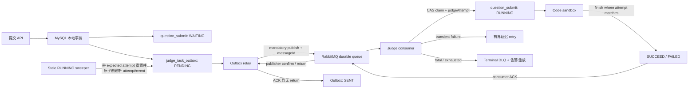

# myoj 判题链路的 RabbitMQ / Transactional Outbox 改进建议

> 调研日期：2026-08-10  
> 范围：只讨论 `question_submit -> judge_task_outbox -> RabbitMQ -> judge consumer -> sandbox -> question_submit`；不讨论 AI Feedback 链路。  
> 资料口径：技术结论以 RabbitMQ、Spring AMQP、Spring Boot、MySQL、Debezium 等官方文档/官方源码为依据；用户提供的腾讯云文章只作为候选方案进行校验。  
> 说明：本文是架构审查与改造建议，没有修改生产代码。

## 1. 结论先行

当前项目**不应因为已有缺陷就删掉 Outbox，然后恢复成“提交事务完成后直接发 MQ”**。只要保留 RabbitMQ，`question_submit` 与待发送事件仍然是两个独立资源；本地事务同时写业务记录和 Outbox，正是避免双写丢消息的正确方向。AWS 的官方架构指南也把“业务表 + Outbox 同一本地事务、独立 relay、幂等消费者”列为解决 dual write 的标准方式，并明确提醒 relay 可能重复发布。[AWS Transactional Outbox](https://docs.aws.amazon.com/prescriptive-guidance/latest/cloud-design-patterns/transactional-outbox.html)

但当前实现还不能宣称“可靠的最终一致性判题链路”，主要有四个高优先级缺口：

1. `convertAndSend()` 返回后立即把 Outbox 标为已发送，没有等待 publisher confirm，也没有检查 return。Spring 官方明确说明 RabbitMQ 发布是异步的；没有匹配队列与不存在的 exchange 是两类不同失败，必须分别用 return 和 confirm/channel failure 观察。[Spring AMQP：Publishing is Asynchronous](https://docs.spring.io/spring-amqp/reference/amqp/template.html#publishing-is-async)
2. `WAITING` 补偿只把 Outbox 的 `PENDING/DISPATCHING` 视为“活跃”，已发送记录不算；任务在队列中等待超过 60 秒时，会每轮继续制造新 Outbox，造成消息放大。
3. `RUNNING` 超时后仅凭 `status` 重置，没有 `judgeAttempt`/执行令牌。旧 worker 如果稍后返回，可能在新 worker 已经把状态重新置为 `RUNNING` 后，用旧结果成功完成 `RUNNING -> SUCCEED/FAILED`，覆盖新一轮判题结果。
4. 生产重试、消费重试和判题超时补偿混成了多个控制面：Outbox 最多 8 次后 `STOP`，但 `WAITING` 补偿又会新建一条重试次数为 0 的 Outbox；消费者的 `basicNack(..., false, false)` 实际是立即进入 DLX，而不是注释所说的“重新入队”。

**最适合当前体量的目标架构**是保留“专用轮询 Outbox + RabbitMQ”，而不是上 Debezium/CDC；补齐 confirm/return，把 Outbox 状态限定为“生产端是否被 broker 接管”，把 `question_submit` 状态限定为“判题业务状态”，再用 `judgeAttempt` 做幂等和 fencing（隔离旧执行结果）。消费失败应有明确的异常分类、有限次延迟重试和终态 DLQ，不能依赖无限立即 requeue。

如果项目的目标只是以最低运维成本跑一个低流量 OJ，而不需要展示 MQ、跨进程削峰或独立扩缩 judge worker，那么更简单且同样正确的备选是：**删除 RabbitMQ 和 Outbox，直接把 `question_submit` 当数据库任务队列**，worker 用短事务 + `FOR UPDATE SKIP LOCKED`/CAS 领取任务。MySQL 官方明确说 `SKIP LOCKED` 不适合一般事务视图，但可用于多个会话竞争 queue-like table。[MySQL 8.0 `SKIP LOCKED`](https://dev.mysql.com/doc/refman/8.0/en/select.html) 不能接受的是“保留 MQ 却删除 Outbox”。

## 2. 先澄清：这里更像可靠异步任务，不是传统跨库业务事务

经典 Transactional Outbox 解决的是：服务 A 修改自己的数据库，同时必须可靠通知服务 B 修改另一个数据库。当前判题链路略有不同：

- 提交服务写入 `question_submit`；
- judge worker 消费任务、调用 sandbox；
- judge worker最终仍通过 Question 服务更新同一条 `question_submit`；
- judge service 没有独立的判题结果数据库事务需要与提交库“跨库原子提交”。

因此，此处 Outbox 的核心价值是**可靠创建并交接异步判题任务**，RabbitMQ 的价值是**削峰、背压、隔离和独立扩缩 worker**。对外介绍时，称为“Transactional Outbox 保证任务创建与任务发布最终一致”比笼统声称“RabbitMQ 实现了分布式事务/Exactly Once”更准确。

## 3. 交付语义必须说清楚

| 语义 | 含义 | RabbitMQ 中的典型实现 | 对当前判题链路的含义 |
| --- | --- | --- | --- |
| **至多一次（at-most-once）** | 处理 0 或 1 次；允许丢失，不重复 | 自动 ACK、处理前 ACK，或发送失败不重试 | 不适合判题任务；用户提交可能永远停在 WAITING |
| **至少一次（at-least-once）** | 处理 1 次或多次；不轻易丢失，但可能重复 | publisher confirm 后才完成发送；未确认发布重发；消费者处理完成后手动 ACK；未 ACK 的 delivery 在连接/信道关闭后重投 | **本项目应选择的传输语义**，要求任务领取和完成具有幂等性 |
| **恰好一次（exactly-once）** | 业务效果只发生一次 | 不能仅靠 RabbitMQ ACK/confirm 跨 MySQL、网络和 sandbox 实现 | 采用“至少一次传输 + 数据库 CAS/唯一键 + attempt fencing”获得 **effectively-once 的结果落库**；sandbox 仍可能执行多次 |

RabbitMQ 官方可靠性指南明确写明：使用 acknowledgements 得到 at-least-once；不用 acknowledgements 只能得到 at-most-once。publisher confirm 丢失时，生产者会重发一个 broker 可能已经接收的消息，因此重复无法消除，消费者必须幂等。[RabbitMQ Reliability Guide](https://www.rabbitmq.com/docs/reliability)

publisher confirm 与 consumer acknowledgement 是彼此独立的两段确认：confirm 只说明 broker 已经对发布承担责任，不说明消费者已经完成业务；consumer ACK 只说明这个 delivery 可由 broker 删除，不会反馈给 Outbox。[RabbitMQ Acknowledgements and Confirms](https://www.rabbitmq.com/docs/confirms)

本项目能做到的目标应表述为：

> 提交与判题事件原子创建；事件至少一次送达；重复 delivery 不会重复写终态；超时后新一轮执行不会被旧一轮结果覆盖。

不应表述为：

> MQ 保证判题端到端 exactly-once，或 publisher confirm 代表判题已经完成。

## 4. 当前实现审查

### 4.1 已经正确、应保留的部分

- [`QuestionSubmitServiceImpl`](../../myoj-backend-question-service/src/main/java/com/qwerlty/myojbackendquestionservice/service/impl/QuestionSubmitServiceImpl.java) 的 `doQuestionSubmit()` 在一个 `@Transactional` 方法里同时写 `question_submit` 与 `judge_task_outbox`，消除了最关键的“业务提交成功但任务没有持久记录”窗口。
- [`JudgeOutboxDispatchTask`](../../myoj-backend-question-service/src/main/java/com/qwerlty/myojbackendquestionservice/job/JudgeOutboxDispatchTask.java) 使用状态 CAS 领取 Outbox，多个 question-service 实例不会在正常情况下同时领取同一行。
- [`QuestionSubmitMapper`](../../myoj-backend-question-service/src/main/java/com/qwerlty/myojbackendquestionservice/mapper/QuestionSubmitMapper.java) 用 `WAITING -> RUNNING` 条件更新领取判题任务，重复消息通常只有一个能首次执行。
- [`RabbitmqConsumer`](../../myoj-backend-judge-service/src/main/java/com/qwerlty/myojbackendjudgeservice/judge/mq/RabbitmqConsumer.java) 使用手动 ACK，并在判题结果落库后才 ACK，方向正确。RabbitMQ 官方要求消费者完成记录、转发或其他责任转移后再 ACK。[RabbitMQ Reliability Guide](https://www.rabbitmq.com/docs/reliability#acknowledgements-and-confirms)
- [`RabbitMqConfig`](../../myoj-backend-judge-service/src/main/java/com/qwerlty/myojbackendjudgeservice/judge/mq/RabbitMqConfig.java) 声明了 durable exchange/queue 和 DLQ，至少具备基础持久拓扑。

### 4.2 P0：Outbox 的“已发送”判定不成立

当前代码：

```text
convertAndSend(...)
markSent(outboxId)
```

`convertAndSend()` 只是发起异步发布。Spring AMQP 官方文档给出的可靠方式是给每次发送传入 `CorrelationData`，等待/监听其 future 的 ACK/NACK；开启 returns 后，无法路由的 returned message 会先写入同一个 `CorrelationData`，然后 future 才完成。[Spring AMQP `CorrelationData` 2.4 API](https://docs.spring.io/spring-amqp/docs/2.4.17/api/org/springframework/amqp/rabbit/connection/CorrelationData.html)、[Spring AMQP Correlated Confirms and Returns](https://docs.spring.io/spring-amqp/reference/amqp/template.html#template-confirms)

当前基础配置中的 `publisher-confirm-type: correlated` 和 `publisher-returns: true` 只是打开能力，没有任何代码消费结果。Spring Boot 2.6.13 会在未显式配置 template mandatory 时，用 `publisherReturns` 推导 `RabbitTemplate.mandatory=true`，所以当前“无路由”消息通常会 return；问题在于应用没有观察这个 return。[Spring Boot 2.6.13 `RabbitTemplateConfigurer` 官方源码](https://github.com/spring-projects/spring-boot/blob/v2.6.13/spring-boot-project/spring-boot-autoconfigure/src/main/java/org/springframework/boot/autoconfigure/amqp/RabbitTemplateConfigurer.java)

正确的 Outbox 状态转换应是：

```text
PENDING -> DISPATCHING
  publish(messageId=outbox.id, CorrelationData=outbox.id, mandatory=true)
  ├─ confirm ACK 且没有 ReturnedMessage -> SENT
  ├─ confirm NACK                     -> PENDING + backoff
  ├─ ReturnedMessage(NO_ROUTE...)     -> PENDING/FAILED + 告警
  └─ timeout/connection failure       -> PENDING + backoff（允许重复）
```

即使 broker 已接收，但应用在写 `SENT` 前崩溃，恢复后仍会重复发布。这不是实现错误，而是 Transactional Outbox 的固有 at-least-once 窗口，所以 message ID 和消费幂等不可省略。

### 4.3 P0：`WAITING` 补偿会放大消息

[`JudgeConsistencyCompensationTask`](../../myoj-backend-question-service/src/main/java/com/qwerlty/myojbackendquestionservice/job/JudgeConsistencyCompensationTask.java) 对所有创建超过 60 秒的 WAITING 提交调用 `countActiveDispatchBySubmitId()`；该查询只计算 Outbox 状态 `0/PENDING` 和 `3/DISPATCHING`，不计算 `1/SENT`。

结果是：只要消息已发送、但因为队列拥堵 60 秒内尚未开始判题，补偿任务就会创建新的 Outbox；新 Outbox 很快变成 SENT，下一轮扫描又会再创建。此逻辑把“队列暂时积压”误判为“消息丢失”，会反向加剧积压。

建议：

- 删除“仅因 WAITING 超过固定时间就重新造消息”的正常补偿路径；
- 改成不变量审计：当前 `submissionId + judgeAttempt` 是否存在任意 Outbox 事件；有 SENT 事件时依赖 durable queue + persistent message + confirm，不重复发布；
- 若确实需要人工重驱，创建新的、显式递增 `judgeAttempt`，而不是复制同一轮事件；
- 为 `(questionSubmitId, judgeAttempt, eventType)` 建唯一索引，阻止多实例补偿的 `count -> insert` 竞态。

### 4.4 P0：状态 CAS 不是完整幂等，缺少 fencing token

当前的 `WHERE id=? AND status=WAITING` 可以阻止两个消费者同时首次领取；但超时补偿改变了前提：

```text
attempt 1: RUNNING，sandbox 仍在执行
    ↓ 180 秒后
补偿任务: RUNNING -> WAITING
attempt 2: WAITING -> RUNNING，开始新执行
attempt 1: 晚到的结果执行 WHERE status=RUNNING，成功写入
```

旧 worker 无法知道当前 `RUNNING` 已经属于 attempt 2。解决方式是在 `question_submit` 增加单调递增的 `judgeAttempt`（或随机 execution token）：

- 领取：`WAITING -> RUNNING, judgeAttempt = judgeAttempt + 1`，返回 attempt；
- MQ 消息携带 `messageId, submissionId, judgeAttempt`；
- 完成：`WHERE id=? AND status=RUNNING AND judgeAttempt=?`；
- 超时重置/失败也带 expected attempt；
- 受影响行数为 0 代表 stale worker，只记录并 ACK，不得覆盖新结果。

这样保证的是结果落库 effectively-once。sandbox 调用仍可能重复；若以后 sandbox 提供幂等 API，可传 `submissionId:judgeAttempt` 作为请求幂等键，否则接受少量重复执行成本。

### 4.5 P1：重试含义冲突，DLQ 被当成了 retry

当前 `basicNack(deliveryTag, false, false)` 的最后一个参数是 `requeue=false`。RabbitMQ 官方定义：负确认且不重新入队时，消息会 dead-letter（若配置 DLX），否则丢弃。[RabbitMQ Dead Letter Exchanges](https://www.rabbitmq.com/docs/dlx)

它不会“稍后重新入队”。同样，“不发 ACK”也不会按固定间隔自动重试：手动确认下，未 ACK delivery 会保持 unacked；连接或信道关闭时才会自动 requeue。[RabbitMQ Consumer Acknowledgements](https://www.rabbitmq.com/docs/confirms#automatic-requeueing)

建议明确区分：

- **瞬时本地失败**：极少量、短退避的 Spring Retry；
- **依赖不可用/需要稍后重试**：进入专用 retry queue，使用 TTL + DLX 延迟回正常队列，或由数据库任务状态安排新的 attempt；不要 `requeue=true` 形成热循环。RabbitMQ 官方说明消息 TTL 到期可以 dead-letter，适合构造延迟 retry queue。[RabbitMQ TTL](https://www.rabbitmq.com/docs/ttl)、[Spring AMQP Retry/Recoverer](https://docs.spring.io/spring-amqp/reference/amqp/resilience-recovering-from-errors-and-broker-failures.html)
- **不可恢复消息**（格式错误、提交不存在等）：reject/no-requeue 到 terminal DLQ；
- **重复/已完成/stale attempt**：ACK，因为目标业务效果已经完成或该 delivery 已失效；
- **DLQ**：停车场和人工/受控重放入口，不是自动无限重试队列。

不要在 listener 中“手工 nack 后又把同一个异常重新抛给 container”形成两个确认责任方。要么 listener 明确 ACK/NACK 后正常返回，要么让 container + retry advice 统一决定。Spring 官方说明 listener 异常、`defaultRequeueRejected`、`AmqpRejectAndDontRequeueException` 与 recoverer 会共同影响 requeue/DLX 行为，必须选择一个控制点。[Spring AMQP Exception Handling](https://docs.spring.io/spring-amqp/reference/amqp/exception-handling.html)

### 4.6 P1：Outbox 的 `STOP` 实际没有停止

Outbox 第 8 次发送失败会标记为 `STOP`；但 WAITING 补偿把 `STOP` 当作“不活跃”，会插入一条 retryCount=0 的新 Outbox。因此：

- `max-retry=8` 不是系统级最大次数；
- 告警面板看到 STOP，也不代表提交停止重试；
- 同一提交可能积累多条 STOP/SENT/PENDING 记录。

需要二选一：

1. 基础设施失败持续低频重试，不设伪终止，但达到阈值强告警；或
2. 达到阈值进入明确 `FAILED`，停止自动重试，并提供有审计的人工 replay。

不能一边标记终止、一边由另一任务静默创建全新的重试链。

### 4.7 P1：长耗时判题需要显式 prefetch 和容量边界

当前 listener 没有显式 prefetch。项目的 Spring AMQP 2.4.x 默认 prefetch 是 250；官方文档明确建议慢处理、大消息、严格顺序或低流量多消费者场景降低 prefetch，必要时设为 1。[Spring AMQP 2.4.7 Reference（listener container `prefetchCount`）](https://docs.spring.io/spring-amqp/docs/2.4.7/reference/pdf/spring-amqp-reference.pdf)

判题是长耗时、受 sandbox 容量限制的工作，建议首版：

- `prefetch=1` 或很小的 2～4，从压测数据调优；
- listener concurrency 与 sandbox 并发槽位一致，不让每个 worker 预占数百条未 ACK 消息；
- RabbitMQ consumer acknowledgement timeout 必须大于最坏判题时长。RabbitMQ 默认值及超时行为见[官方 Consumers 文档](https://www.rabbitmq.com/docs/consumers#acknowledgement-timeout)。

### 4.8 P2：持久性、HA、拓扑治理和清理

- RabbitMQ 官方要求重要数据使用 durable queue（或 replicated queue）和 persistent message；要保证持久发布，还需要 publisher confirm。[RabbitMQ Reliability Guide](https://www.rabbitmq.com/docs/reliability#data-safety-on-the-rabbitmq-side)、[RabbitMQ Confirms](https://www.rabbitmq.com/docs/confirms#publisher-confirms-and-guaranteed-delivery)
- 代码已把队列声明为 durable，但消息属性应显式设置 persistent、messageId、contentType、eventType/schemaVersion，不要依赖 converter 默认值。
- 如果生产环境是 3 节点 RabbitMQ 且确实需要节点故障下高可用，可把主队列设为 quorum queue；RabbitMQ 官方将 quorum queue 定义为基于 Raft 的 durable replicated queue。单机部署时声明 quorum 不会凭空获得 HA，不必为简历过度设计。[RabbitMQ Quorum Queues](https://www.rabbitmq.com/docs/quorum-queues)
- 当前 DLX 通过代码硬编码 `x-dead-letter-*` 参数。RabbitMQ 官方强烈建议可变的 DLX/TTL 使用 policy，因为 hardcoded x-arguments 需要删除/重建队列和重新部署才能修改。[RabbitMQ DLX Policies](https://www.rabbitmq.com/docs/dlx#configuring-a-dead-letter-exchange-using-optional-queue-arguments)
- SENT Outbox 需要保留期和定时清理/归档，否则表会永久增长。推荐先保留 7～30 天用于审计；删除任务按主键小批量执行。

## 5. 推荐的目标架构



职责边界：

| 状态/组件 | 只负责什么 | 不负责什么 |
| --- | --- | --- |
| `judge_task_outbox.status` | 生产端事件是否待发、发送中、被 broker confirm、终止 | 不表示判题是否开始/完成 |
| `question_submit.status` | WAITING/RUNNING/终态 | 不表示 RabbitMQ 是否 confirm |
| `judgeAttempt` | 隔离每次可执行判题，拒绝 stale completion | 不承担发布重试次数 |
| RabbitMQ retry/DLQ | delivery 的短期延迟重试与 terminal parking | 不替代业务状态和超时 lease |
| stale RUNNING sweeper | 修复 worker 崩溃/永久挂起的业务 lease | 不扫描所有 SENT 事件并盲目重复发布 |

### 5.1 建议的最小消息格式

当前 payload 只有一个字符串 submit ID，无法携带事件身份和 attempt。建议发送一个很小的、带版本 envelope：

```json
{
  "messageId": "outbox-row-id",
  "eventType": "JUDGE_REQUESTED",
  "schemaVersion": 1,
  "submissionId": 123,
  "judgeAttempt": 1,
  "createdAt": "2026-08-10T12:00:00Z"
}
```

- AMQP `message_id` 也设置为同一个 `messageId`；
- message 本身持久化；
- `submissionId + judgeAttempt + eventType` 在 Outbox 建唯一键；
- 判题所需代码、题目和用例仍从权威数据库读取，不把大对象复制进 MQ。

专用 Outbox 的 exchange/routing key 固定在配置/代码中是合理简化，不必为了“通用消息平台”增加 targetSystem 字段。`payload` 是否保留取决于审计需要：若保留，就必须视为不可变的实际发送快照；若不保留，可由 Outbox 列稳定构建上述 envelope。

### 5.2 建议的 Outbox 领取与 confirm 流程

1. 短事务领取到期事件，状态改为 `DISPATCHING`，记录 `lockedBy/lockedUntil`；
2. 提交数据库事务，**不要持有数据库锁等待 MQ**；
3. 发布 persistent 消息，传 `CorrelationData(outboxId)`；
4. 在小超时内等待 future，或由 confirm callback 异步更新；
5. ACK 且 `returned == null` 才标记 SENT；NACK/return/timeout 回到 PENDING 并退避；
6. `lockedUntil` 大于 confirm timeout，过期 lease 才允许其他实例恢复；
7. broker ACK 后、SENT 写入前崩溃会重复发，交给消费幂等处理。

当前“先 SELECT，再逐行 CAS”在小流量下正确但竞争较多，可以继续使用。多实例/高吞吐时再改成 MySQL 8 `FOR UPDATE SKIP LOCKED` 批量领取；官方明确把它列为 queue-like table 降低锁竞争的用途。[MySQL `SKIP LOCKED`](https://dev.mysql.com/doc/refman/8.0/en/select.html)

### 5.3 建议的消费异常决策表

| 情况 | 数据库动作 | MQ 动作 |
| --- | --- | --- |
| 第一次有效 delivery | CAS `WAITING -> RUNNING`，返回 attempt token | 执行 sandbox，先不 ACK |
| 结果成功落库 | `RUNNING + expectedAttempt -> terminal` | ACK |
| 已是终态/同 message 重复 | 不做业务副作用 | ACK |
| stale attempt | 不允许写结果 | ACK |
| 短暂网络抖动 | 保持/恢复为可重试状态，受控计数 | 短本地重试，仍失败则延迟 retry |
| worker 崩溃且未 ACK | 由 lease/sweeper 修复 RUNNING，旧 attempt 失效 | RabbitMQ 连接关闭后会自动 redeliver；必要时由 sweeper 原子创建新 attempt event |
| 非法 JSON/未知 schema/不存在的提交 | 不进入业务执行 | reject/no-requeue -> terminal DLQ |
| 超过业务最大重试 | 原子写 FAILED + 错误摘要 | ACK 原消息；可另发告警事件，或 terminal DLQ 二选一并保持语义一致 |

若消费逻辑以后在 judge 自己的数据库产生非幂等写入，再增加 `processed_message(message_id unique)` Inbox，并让“插入 Inbox + 业务更新”在同一本地事务中完成。当前判题结果的事实源仍在 question service，优先使用 `question_submit` 的状态机 + attempt fencing；额外 Redis 去重既与数据库写入不原子，又受 TTL/淘汰影响，不是这里的首选。

## 6. 轮询 Outbox 与 CDC / Debezium 的选择

| 维度 | 应用轮询 Outbox | Debezium / CDC Outbox |
| --- | --- | --- |
| 原理 | 应用扫描 committed Outbox，发 MQ，写发送状态 | connector 读 MySQL binlog，Outbox Event Router 转换 INSERT 事件 |
| 额外基础设施 | 无，复用现有服务/MySQL/RabbitMQ | Debezium Server 或 Kafka Connect、offset/schema history 存储、binlog 权限与运维 |
| 延迟 | 受 3 秒轮询间隔影响 | 通常更接近实时 |
| 数据库影响 | 有索引扫描和状态 UPDATE | 主要读取 binlog；应用 Outbox 可 append-only |
| 交付语义 | 至少一次；confirm 成功后写状态仍有重复窗口 | Debezium MySQL 在异常恢复场景也是至少一次，仍需幂等 |
| 与当前表兼容性 | 兼容当前 PENDING/DISPATCHING/SENT 模型 | 官方 Outbox Event Router 预期 Outbox 只有 INSERT；UPDATE 会按配置 warn/error/fatal，当前状态更新表不能直接照搬 |

Debezium 官方 Outbox Event Router 明确要求 connector 只捕获 Outbox 表，并提供事件 ID 供消费者去重；它期望 Outbox 是 INSERT-only，DELETE 会被过滤，UPDATE 被视为异常操作。[Debezium Outbox Event Router](https://debezium.io/documentation/reference/stable/transformations/outbox-event-router.html) Debezium MySQL connector 在异常恢复时提供 at-least-once，而不是免幂等的 exactly-once。[Debezium MySQL Connector](https://debezium.io/documentation/reference/stable/connectors/mysql.html)

Debezium Server 官方已有 RabbitMQ sink 配置及 broker confirm timeout，但引入它仍意味着增加一个独立 CDC 运行时及 offset 管理。[Debezium Server RabbitMQ Sink](https://debezium.io/documentation/reference/stable/operations/debezium-server.html#_rabbitmq_stream)

**本项目现阶段推荐继续轮询**，理由是：

- 只有一个很小的判题事件类型；
- 3 秒级发布延迟可接受；
- 已有 relay、状态、指标和迁移表，修复 confirm 与 attempt 比替换基础设施风险低；
- CDC 不能消除重复、消费幂等、DLQ 和 stale worker 问题，只是替换“如何发现新 Outbox 行”。

满足以下条件再评估 Debezium：多个服务/多类事件统一 Outbox；轮询对主库的扫描和 UPDATE 已被指标证明是瓶颈；需要亚秒级事件传播；团队已经有 Kafka Connect/Debezium 的部署、监控、offset 恢复和 binlog 保留能力。

## 7. 对用户提供的腾讯云文章逐项校验

候选文章：[《分布式事务本地消息表详解：中小团队的低侵入落地方案》](https://cloud.tencent.com/developer/article/2609169)。文章的总体选型与本项目方向一致，但一些 RabbitMQ 语义写得过于笼统，不能直接照抄。

| 文章建议 | 是否适合 myoj | 需要的官方语义修正 |
| --- | --- | --- |
| 业务数据与本地消息表同一本地事务 | **适合，当前已做到** | 这是 Outbox 的根基；只保证事件被持久创建，不代表已经进入 MQ。[AWS Outbox](https://docs.aws.amazon.com/prescriptive-guidance/latest/cloud-design-patterns/transactional-outbox.html) |
| 定时扫描待投递消息，指数退避 | **适合** | “投递成功”必须定义为 confirm ACK 且没有 return，不能以 `send()` 正常返回判断。[Spring AMQP template](https://docs.spring.io/spring-amqp/reference/amqp/template.html#template-confirms) |
| message ID 唯一索引、状态+下次时间索引 | **适合** | 对本项目应再加入 `judgeAttempt`，唯一键建议是 `submissionId + attempt + eventType`；message ID 随消息传到消费者。 |
| 消费成功 ACK；失败不 ACK，MQ 按间隔重试 | **前半句适合，后半句不准确** | 未 ACK 通常保持 unacked，连接/信道关闭才自动 requeue；`nack(requeue=true)` 往往立即重投。延迟重试需要 retry queue + TTL/DLX 或明确的应用调度。[RabbitMQ confirms/acks](https://www.rabbitmq.com/docs/confirms)、[RabbitMQ TTL](https://www.rabbitmq.com/docs/ttl) |
| 重试超过阈值进入 DLQ | **适合，但当前没有 retry 阶段** | 当前第一次异常就是 `nack(requeue=false)`，会立即 DLQ。需先定义可重试异常、次数和退避；DLQ 要有告警、检查和受控 replay。 |
| 消费方用消息 ID/业务键幂等 | **适合** | 判题用状态机 + attempt fencing；不要机械照搬 Redis set。非幂等数据库副作用应把 Inbox 唯一键与业务写放在同一个数据库事务。 |
| 生产端消息表记录“已消费”，消费后回调生产端 | **不推荐用于本项目** | consumer ACK 与 publisher confirm 相互独立，RabbitMQ 不会把 ACK 回传到 Outbox。项目已有 `question_submit` 表示端到端判题状态，再做消费回写会重复建模并增加耦合。[RabbitMQ confirms/acks are orthogonal](https://www.rabbitmq.com/docs/confirms#are-publisher-confirms-related-to-consumer-delivery-acknowledgements) |
| 持久化 MQ 即保证不丢 | **条件成立时适合** | 需要 durable/replicated queue + persistent message + publisher confirm；网络不确定时仍会重复。[RabbitMQ Reliability Guide](https://www.rabbitmq.com/docs/reliability) |
| 达阈值标记投递失败并人工介入 | **可以** | 一旦停止自动重试就不能再宣称“最终一定送达”；必须告警、runbook 和可审计 replay。当前 STOP 后又由 WAITING scanner 重建，语义冲突。 |
| 定期清理/归档已完成消息 | **适合，当前缺失** | Outbox 只需保留可排障窗口；不必为了追踪消费终态永久保存。 |

文章说“本地消息表是中小团队首选”对这个单一异步任务场景大体成立，但不能推出“任何跨服务流程都应使用本地消息表”。本项目也不需要文章中可选的消费确认回写，更不需要把专用 Outbox 做成通用消息中心。

## 8. 不推荐的过度设计与错误替代

1. **现阶段引入 Debezium + Kafka Connect/Server**：只为一个判题事件替换 3 秒轮询，运维成本高于收益。
2. **引入 2PC/XA 或把 Spring Rabbit transaction 当成 MySQL+RabbitMQ 原子事务**：Spring 官方明确指出 `RabbitTransactionManager` 不能提供跨数据库与消息的 XA；与数据库同步只是 Best Effort 1PC，Rabbit commit 仍可能在数据库完成后失败。[Spring AMQP Transactions](https://docs.spring.io/spring-amqp/reference/amqp/transactions.html)
3. **追求 RabbitMQ 端到端 exactly-once**：confirm/ACK 天生存在“对端完成但确认丢失”的不确定窗口。应设计幂等，而不是用术语掩盖重复。
4. **为当前专用事件造通用事件平台**：暂不需要目标系统、任意 exchange/routing、动态 schema registry、多租户等字段。
5. **Redis 分布式锁 + Redis 消息去重 + 数据库状态三层并用**：增加新的失效窗口；当前用数据库条件更新、唯一键和 attempt token 足够。
6. **无限 `nack(requeue=true)`**：会形成热循环、吞吐抖动和 poison message；应有限重试后进入 terminal DLQ。
7. **仅开启 `publisher-confirm-type` 就宣称可靠发布**：没有 correlation/callback/future 与 Outbox 状态机绑定，配置等于没有闭环。
8. **在 MQ 仍存在时删除 Outbox**：重新引入“数据库已提交、发布失败”的 dual-write 缺口。

## 9. 渐进改造顺序

### 第一阶段：先修正确性

1. 消息增加 `messageId + submissionId + judgeAttempt + schemaVersion`；
2. `question_submit` 增加 `judgeAttempt`，claim/finish/reset 全部校验 expected attempt；
3. `RabbitmqProducer` 传 `CorrelationData`，Outbox 只在 confirm ACK 且无 return 时 SENT；
4. 删除 WAITING 超时后基于“没有 PENDING/DISPATCHING”反复造消息的逻辑；
5. 修正 consumer：明确 duplicate/stale/fatal/transient 分支；不要 nack 后再次抛异常；
6. 把 stale RUNNING 的重置与新 attempt Outbox 写入放在同一本地事务。

### 第二阶段：统一重试与运维

1. 配置有限的延迟 retry queue 与 terminal DLQ，或选择数据库调度重试；只保留一个消费重试控制面；
2. 给 DLQ 增加告警、查看和受控 replay runbook；
3. 明确 prefetch、listener concurrency、sandbox 并发和 consumer timeout；
4. 使用 RabbitMQ policy 管理 DLX/TTL；生产集群确有 HA 需求时再使用 quorum queue；
5. 清理/归档旧 SENT Outbox。

### 第三阶段：验证而不是继续堆机制

至少做以下故障注入测试：

- 提交事务在写业务表/Outbox 后回滚：两者都不存在；
- broker 不可达：Outbox 保持 PENDING 并退避；
- exchange 存在但 routing key 无绑定：收到 return，不能 SENT；
- broker 已 ACK、SENT 更新前进程崩溃：发生重复消息，但只产生一个有效判题结果；
- consumer 在 claim 后崩溃：消息重投/补偿后能继续；
- attempt 1 超时、attempt 2 开始、attempt 1 晚到：attempt 1 完成更新必须影响 0 行；
- poison message：有限次后进入 DLQ，不热循环；
- 队列积压超过 60 秒：Outbox 数量不因 WAITING scanner 线性放大。

建议监控：Outbox pending 数/最老年龄、dispatching lease 超时数、confirm latency、NACK/return/timeout 计数、队列 ready/unacked、DLQ 深度、WAITING/RUNNING 最老年龄、stale completion 拒绝数、每个 attempt 的 sandbox 时长与重试次数。

## 10. 最终取舍

对当前 myoj，建议采用：

> **MySQL 本地事务写提交 + 专用轮询 Outbox；RabbitMQ persistent/durable + publisher confirm/return；消费者手动 ACK；`question_submit` 状态机 + `judgeAttempt` fencing；有限延迟重试 + terminal DLQ；仅对 stale RUNNING 做业务补偿。**

这是一条 at-least-once 的可靠任务链路，通过幂等和 fencing 获得结果落库的 effectively-once。它保留现有架构投资，修复真正的正确性问题，又避免为一个低到中等规模的判题事件引入 CDC、XA、通用事件平台或多套去重基础设施。

如果未来压测证明 RabbitMQ 本身没有提供必要价值，则应完整切换到 MySQL job queue，而不是同时保留 `question_submit` 扫描、Outbox 扫描、RabbitMQ retry 和补偿扫描四套近似队列。

## 11. 一手资料索引

- [RabbitMQ Reliability Guide](https://www.rabbitmq.com/docs/reliability)
- [RabbitMQ Consumer Acknowledgements and Publisher Confirms](https://www.rabbitmq.com/docs/confirms)
- [RabbitMQ Dead Letter Exchanges](https://www.rabbitmq.com/docs/dlx)
- [RabbitMQ Time-To-Live](https://www.rabbitmq.com/docs/ttl)
- [RabbitMQ Quorum Queues](https://www.rabbitmq.com/docs/quorum-queues)
- [RabbitMQ Consumers / Acknowledgement Timeout](https://www.rabbitmq.com/docs/consumers#acknowledgement-timeout)
- [Spring AMQP `RabbitTemplate`: async publishing, confirms and returns](https://docs.spring.io/spring-amqp/reference/amqp/template.html)
- [Spring AMQP Transactions](https://docs.spring.io/spring-amqp/reference/amqp/transactions.html)
- [Spring AMQP Exception Handling](https://docs.spring.io/spring-amqp/reference/amqp/exception-handling.html)
- [Spring AMQP Retry and Recovery](https://docs.spring.io/spring-amqp/reference/amqp/resilience-recovering-from-errors-and-broker-failures.html)
- [Spring AMQP 2.4 `CorrelationData` API](https://docs.spring.io/spring-amqp/docs/2.4.17/api/org/springframework/amqp/rabbit/connection/CorrelationData.html)
- [Spring Boot 2.6.13 `RabbitTemplateConfigurer` source](https://github.com/spring-projects/spring-boot/blob/v2.6.13/spring-boot-project/spring-boot-autoconfigure/src/main/java/org/springframework/boot/autoconfigure/amqp/RabbitTemplateConfigurer.java)
- [MySQL 8.0 `SELECT ... SKIP LOCKED`](https://dev.mysql.com/doc/refman/8.0/en/select.html)
- [Debezium Outbox Event Router](https://debezium.io/documentation/reference/stable/transformations/outbox-event-router.html)
- [Debezium MySQL Connector](https://debezium.io/documentation/reference/stable/connectors/mysql.html)
- [Debezium Server](https://debezium.io/documentation/reference/stable/operations/debezium-server.html)
- [AWS Prescriptive Guidance: Transactional Outbox](https://docs.aws.amazon.com/prescriptive-guidance/latest/cloud-design-patterns/transactional-outbox.html)

