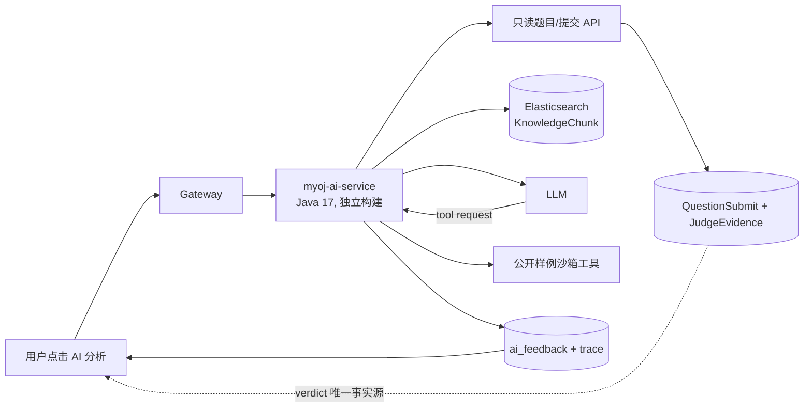

# myoj 的 RAG + Agent 轻量改造方案：AI 错题教练

> 调研日期：2026-08-10  
> 目标：在不重写现有 OJ 判题链路的前提下，增加一个能在校招简历和面试中讲清楚、可演示、可度量的 RAG + Agent 模块。  
> 资料口径：只使用项目官方仓库、框架官方文档和论文原文；明确区分“已有 OJ/教学系统中的真实功能”和“可迁移的相似实现”。

## 1. 结论先行

最适合本项目的方向不是“AI 自动出题”或“让 Agent 自动写代码并反复提交”，而是一个 **AI 错题教练**：用户在 CE/RE/WA/TLE 等失败提交后主动点击“AI 分析”，系统把题目、提交代码、确定性判题证据和经过权限过滤的算法知识送入一个有上限的工具调用 Agent，返回**分层提示、错误定位、复杂度建议和可追溯知识引用**，但不泄露隐藏用例或完整答案。

推荐把它做成独立的 `myoj-ai-service` 侧车，原有 `question -> MQ/outbox -> judge -> code sandbox -> verdict` 链路不改语义。现有判题服务仍是 AC/WA 的唯一事实来源；AI 服务只读取证据并写自己的反馈记录。这样改造范围可控，同时能形成一个完整的简历故事：

```text
失败提交
  -> 结构化 JudgeEvidence
  -> 混合检索（题目/标签/错误类型过滤 + BM25 + 向量召回）
  -> 有界 Tool Agent（最多 3 步，只读白名单工具）
  -> 引用可追溯的分层提示
  -> 记录检索命中、工具轨迹、延迟、Token 和后续是否 AC
```

不建议首版做多 Agent、自动修改并提交代码、开放任意 shell、全量索引用户 AC 代码或改造整个判题架构。这些工作量大、作弊和安全边界差，而且面试时很容易被追问成“套框架”。

## 2. 当前项目为什么适合这个切口

当前项目已经具备 AI 教练所需要的大部分业务上下文：

- [`Question`]（`../../myoj-backend-model/src/main/java/com/qwerlty/myojbackendmodel/model/entity/Question.java`）已有题面、标签、答案、判题用例和配置；
- [`QuestionSubmit`]（`../../myoj-backend-model/src/main/java/com/qwerlty/myojbackendmodel/model/entity/QuestionSubmit.java`）已有用户代码、语言、判题状态和 `judgeInfo`；
- [`QuestionSubmitServiceImpl`]（`../../myoj-backend-question-service/src/main/java/com/qwerlty/myojbackendquestionservice/service/impl/QuestionSubmitServiceImpl.java`）已经采用提交记录 + Outbox 的可靠投递思路；
- [`JudgeServiceImpl`]（`../../myoj-backend-judge-service/src/main/java/com/qwerlty/myojbackendjudgeservice/judge/JudgeServiceImpl.java`）和 [`JudgeManager`]（`../../myoj-backend-judge-service/src/main/java/com/qwerlty/myojbackendjudgeservice/judge/JudgeManager.java`）能提供确定性的执行与 verdict；
- 父 [`pom.xml`]（`../../pom.xml`）已经包含 Elasticsearch starter，但当前配置未启用；因此可以复用其搜索能力，不过必须正视当前 Java 8 / Spring Boot 2.6.13 的版本约束。

真正缺失的不是“调用一次大模型”，而是两块：一是把判题过程保留为 Agent 可引用的结构化证据，二是把题解/算法知识整理成有权限和提示等级的检索语料。

## 3. 网上有没有类似做法

### 3.1 已确认存在于 OJ 或自动判题教学场景中的实现

| 项目/论文 | 能确认的真实功能 | 对 myoj 的启发 | 不能据此声称的内容 |
| --- | --- | --- | --- |
| **Artemis + Iris/Pyris** | 这是本次调研中最接近目标、且能核验源码的开源参考：Artemis 是带自动反馈的交互式学习平台；Iris 是直接集成其中的 AI tutor，会读取编程题题面、学生代码和自动反馈并给渐进式帮助；Pyris 则是单独部署的 LLM microservice。[Artemis 官方仓库](https://github.com/ls1intum/Artemis)、[Pyris 官方仓库](https://github.com/ls1intum/Pyris)、[Iris 论文](https://arxiv.org/abs/2405.08008)、[官方介绍](https://ls1intum.github.io/edutelligence/iris/docs/overview/what-is-iris/) | 直接验证了“判题/学习主系统 + 独立 AI 微服务 + 自动注入题面/代码/反馈 + 不直接泄露答案”的边界，和 myoj 的侧车方案高度一致。 | Artemis 是课程作业/持续集成式自动评测平台，不是传统竞赛 OJ；其系统规模和仓库式编程作业也大于 myoj，不能照搬全部学习分析、课程和版本库功能。 |
| **CodeRunner Agent** | 论文明确称其已开发并嵌入 Moodle，结合 CodeRunner 自动判题插件；上下文包含课程材料、编程题、学生答案和执行结果，知识上下文引擎会把教师上传的材料和练习转为文本知识供检索，并记录用户与 Agent 的交互。[论文原文](https://arxiv.org/abs/2504.03068)、[CodeRunner 官方源码](https://github.com/trampgeek/moodle-qtype_coderunner) | “判题结果 + 课程/题目知识 + 学习历史”比单纯把源码塞给模型更可靠；反馈模块可以独立附着在现有判题系统上。 | 论文原型不等于可直接复用的 Java 服务；本文未找到作者公开的 CodeRunner Agent 后端源码，不能臆造其数据库、向量库或 Agent 框架。论文也把课堂效果评估列为后续工作。 |
| **RAGMan** | 论文报告其在 455 人的编程入门课中按 5 个作业配置 5 个 tutor。每个 tutor 有独立知识库和定制 prompt；后端先检索向量库，再组合角色、作业目标、简述、检索文本、对话和回答约束，并增加最终回复不得包含代码的校验步骤。论文对范围内问题报告 98% 的良好回复率，但也明确说明这不是可做因果推断的对照实验。[论文原文](https://arxiv.org/abs/2407.15718) | 不必做“全题库万能 tutor”；按题目/标签限制检索范围和 prompt 更容易评估，也更能抑制答案泄露。最终输出应有独立校验，而不能只靠 system prompt。 | 论文投稿版本中的前端仓库链接被匿名化，不能把 RAGMan 当作可直接拉取的开源实现，也不能把其课堂指标写成 myoj 指标。 |
| **Context-Aware Feedback Compression in Online Judge Programming with LLMs（FSE 2026）** | 官方会议页描述了一个 OJ 风格的模块化交互 Agent：LLM core、沙箱判题器、feedback-to-hint prompt constructor、trajectory memory，以及可选错误分类器。其核心是把嘈杂执行信息压缩为紧凑提示；页面报告在 570 个真实 Codeforces 失败提交上，调试成功率由 one-shot 的 83.9% 提升到 93.2%。[FSE 官方页面](https://conf.researchr.org/details/fse-2026/fse-2026-ideas-visions-and-reflections/14/Context-Aware-Feedback-Compression-in-Online-Judge-Programming-with-LLMs) | 在 LLM 前增加确定性的 `EvidenceNormalizer`，只提供首个关键错误、输出差异摘要和资源使用；记录轨迹并评价下一轮是否收敛。 | 这是研究论文，不是可直接引入的开源模块；论文结果也不能写成 myoj 自己的指标。 |

### 3.2 开源 OJ 的事实基线：判题器不是 Agent

- DMOJ 官方仓库展示的是多语言、交互题、自定义 checker、资源限制、分布式 judging server、比赛和题解等确定性 OJ 能力，官方功能清单没有宣称内置 RAG 或 AI 辅导。[DMOJ 官方仓库](https://github.com/DMOJ/online-judge)
- Judge0 是可横向扩展的沙箱代码执行 API，提供详细执行结果和 webhook，并明确可作为 AI agent 的代码执行后端；但 Judge0 自身不是带教学知识库、规划和记忆的 Agent。[Judge0 官方仓库](https://github.com/judge0/judge0)
- Moodle CodeRunner 会在沙箱中运行学生代码、按测试比较结果并即时反馈；其官方仓库同样证明了“执行/评分服务”应和上层 AI 辅导分开。[CodeRunner 官方仓库](https://github.com/trampgeek/moodle-qtype_coderunner)、[Jobe 沙箱服务](https://github.com/trampgeek/jobe)

因此，调研没有支持“在现有 judge 里塞一个 LLM 就完成 Agent”的做法；更可信的共同模式是：**确定性判题产生证据，AI 在其上做解释和下一步建议。**

### 3.3 可迁移的相似实现和框架能力

| 来源 | 已验证能力 | 建议迁移的部分 |
| --- | --- | --- |
| **CodeAid** | 在约 700 人课程中部署 12 周，支持概念回答、逐行解释的伪代码和对错误代码的注释式建议，并刻意避免直接给完整代码答案。[论文原文](https://arxiv.org/abs/2401.11314) | 采用“提示而非答案”的输出 guardrail；让用户选择“解释题意 / 定位错误 / 给一个提示 / 分析复杂度”，避免一个万能聊天框。 |
| **Zero2Leetcode** | 作者公开练习场把题面、编辑器、测试结果和 AI 刷题助手放在同一交互中，并提供“看看代码 / 给提示 / 解释题目 / 分析报错 / 优化代码”等固定入口。[公开练习场](https://onefly.top/zero2Leetcode/playground.html)、[ACM 练习场](https://onefly.top/zero2Leetcode/acm-playground.html) | UI 先做几个固定意图，能让上下文和验收标准清晰；对校招项目比开放式聊天更容易完成。公开页面未提供可核验的后端源码，因此这里只迁移产品切片，不推测其 Agent/RAG 架构。 |
| **LangChain4j RAG** | 官方文档把 RAG 分为离线 indexing 和在线 retrieval，支持 metadata、向量检索以及可组合的 query transform / retriever / aggregator / injector；官方也明确当前最低 JDK 为 17。[RAG 官方文档](https://docs.langchain4j.dev/tutorials/rag/)、[安装要求](https://docs.langchain4j.dev/get-started) | 新 AI 服务可以采用其 `ContentRetriever`、AI Service 和工具调用能力；不要把当前 Java 8 父工程直接升级或锁在旧版 LangChain4j。 |
| **Spring AI Tool Calling** | 官方文档说明：模型只能请求工具调用，真正的 API 解析和执行由应用负责，模型并不会直接获得 API 权限。[官方文档](https://docs.spring.io/spring-ai/reference/api/tools.html) | 工具必须是应用侧白名单并做鉴权、参数校验和超时；Agent 无权修改 `QuestionSubmit.status` 或 verdict。当前 Spring AI 2.0 面向 Spring Boot 4.x，不适合直接塞进现有 Boot 2.6 父工程。[版本说明](https://docs.spring.io/spring-ai/reference/getting-started.html) |
| **Elasticsearch** | 当前项目版本线对应的 Elasticsearch 7.15 已支持 `dense_vector` 和通过 `script_score` 计算 cosine similarity，但向量函数会线性扫描匹配文档，官方建议先用 query/filter 缩小集合。[7.15 dense_vector](https://www.elastic.co/guide/en/elasticsearch/reference/7.15/dense-vector.html)、[7.15 script_score](https://www.elastic.co/guide/en/elasticsearch/reference/7.15/query-dsl-script-score-query.html)；新版本官方则推荐用 RRF 融合全文和向量结果。[当前混合检索文档](https://www.elastic.co/docs/solutions/search/hybrid-search) | MVP 先按 `questionId/tags/verdict/language/visibility` 过滤，再分别做 BM25 与向量召回，在应用侧用 RRF 合并；不要把新版本原生 RRF API误写成 ES 7.15 已有能力。 |

## 4. 推荐产品定义：AI 错题教练

### 4.1 用户侧只做四个入口

1. **为什么错了**：根据 CE/RE/WA/TLE 及结构化证据解释根因；
2. **给我一个提示**：按 `hintLevel=1/2/3` 逐层展开，不直接给可提交代码；
3. **解释这道题**：检索题目涉及的数据结构、算法概念和复杂度知识；
4. **分析复杂度**：结合代码结构和题目约束给复杂度风险提示。

第一版只允许在普通练习、已失败的本人提交上调用；比赛进行中默认禁用，AC 后可开放“复盘”。AI 反馈不参与得分、不改 verdict、不展示隐藏用例。

### 4.2 RAG 不是检索整份 `answer`

题面和当前提交属于**确定性上下文**，无需用向量检索；真正的 RAG 语料应是经管理端确认的“小知识卡”：

```text
KnowledgeChunk {
  id, questionId?, tags[], language?,
  knowledgeType: CONCEPT | COMMON_MISTAKE | COMPLEXITY | HINT,
  hintLevel: 1 | 2 | 3,
  visibility: PUBLIC_HINT | AFTER_AC | ADMIN_ONLY,
  content, sourceTitle, sourceVersion, embedding
}
```

建议从 30～50 道有代表性的题开始，手工或半自动把 `answer` 拆成“知识点、常见错误、分级提示、复杂度”，管理员确认后入库。不要在 MVP 索引所有用户 AC 代码：它会带来答案泄露、代码质量、隐私和重复内容问题；也不要让 `judgeCase` 和隐藏期望输出进入检索库。

检索 query 由 `用户意图 + verdict + 错误摘要 + 题目标签 + 代码语言` 组成。先做元数据权限过滤，再取 BM25 Top 20 和向量 Top 20，应用侧 RRF 融合后给 Agent 3～5 个 chunk。最终回答必须返回实际使用的 `chunkId/sourceTitle`；不存在于检索结果的引用直接判为校验失败。

### 4.3 Agent 要“有工具、有选择、有上限”

推荐单 Agent，而不是多 Agent。题面、提交代码和当前判题证据由应用在调用前固定注入；模型只能从以下只读工具中选择：

| Tool | 用途 | 安全边界 |
| --- | --- | --- |
| `search_knowledge` | 按当前题目、标签、错误类型检索知识卡 | 强制 metadata/visibility 过滤，最多返回 5 条 |
| `get_attempt_history` | 读取本人在当前题的最近几次 verdict 和错误摘要 | 不返回其他用户代码，不返回隐藏用例 |
| `run_public_sample` | 用当前代码重跑题目公开样例，得到实际/期望输出 | 只允许公开样例、复用现有沙箱、严格超时限流 |
| `inspect_code_structure` | 用 AST/规则提取循环、递归、集合和可疑行 | 确定性静态分析，不执行 LLM 生成代码 |

循环建议固定为：`PLAN -> (CALL_TOOL -> OBSERVE，最多 3 次) -> GENERATE -> VALIDATE -> SAVE`。达到步数/时间/Token 上限、模型超时或校验失败时，降级为规则化判题说明。应用负责执行工具和保存结果，LLM 不能直接访问数据库、Feign、Redis、MQ 或沙箱。

### 4.4 最先补齐 `JudgeEvidence`

当前 `judgeInfo` 主要保存 verdict、时间和内存，给 LLM 的证据不够。建议新增独立 JSON 列或 `judge_evidence` 表，至少保留：

```text
JudgeEvidence {
  submissionId, questionId, language, verdict,
  compileError?, runtimeError?,
  failedPublicCaseIndex?, expectedDigest?, actualDigest?, diffSummary?,
  timeMs?, memoryKb?, timeLimitMs?, memoryLimitKb?,
  sourceDigest, judgeRuleVersion, createdAt
}
```

隐藏测试只保存脱敏摘要，例如“边界输入下实际输出行数少 1”，不把原始输入/期望输出交给 Agent。`sourceDigest` 和规则版本用于证明反馈对应哪次提交，避免题目或代码更新后引用错证据。

## 5. 最小架构与改动面



推荐 `myoj-ai-service` 使用 Java 17 独立 POM/容器，不继承当前 Java 8 的父工程依赖版本；它通过 HTTP 调用现有服务的**脱敏内部 DTO**，由网关增加一条路由。这样不用升级现有七个微服务，同时可以使用当前 LangChain4j。若团队不想引入第二条 JDK 构建线，次优方案是在 Java 8 服务中直接封装 OpenAI-compatible HTTP API 并手写有限状态循环，但简历上应如实写“tool-calling workflow”，不要夸成通用 Agent 平台。

建议的最小持久化只有：

- `judge_evidence`：确定性判题证据；
- `ai_feedback`：`userId/submissionId/intent/content/citations/model/promptVersion/tokenUsage/latency/status`；
- Elasticsearch `oj_knowledge_v1`：知识 chunk 与 embedding。

不需要首版引入多 Agent 表、长期记忆向量、工作空间、MCP、Kafka 或新的代码沙箱。

## 6. 实施顺序（约 7～10 个开发日）

### 阶段 1：证据层，1～2 天

- 从沙箱执行结果提取 CE/RE/WA/TLE 的规范化证据并持久化；
- 增加只返回本人提交和脱敏题目信息的内部 API；
- 为每类 verdict 准备 5～10 个固定测试 fixture。

验收条件：不用 LLM 也能根据 `JudgeEvidence` 生成正确的规则化说明。

### 阶段 2：小规模 RAG，2～3 天

- 为 30～50 道题制作分级知识卡，建立 `oj_knowledge_v1` mapping；
- 实现 embedding 入库、metadata filter、BM25/向量双召回和应用侧 RRF；
- 返回 chunk 引用并做离线 Recall@K 检查。

验收条件：给定“二分边界 + WA”等查询，Top 5 能稳定命中预期知识卡，且绝不会越过 `visibility`。

### 阶段 3：有界 Agent 和页面，2～3 天

- 实现四个只读工具、最多三步的循环、结构化输出和超时降级；
- 增加“为什么错了 / 给一个提示 / 复杂度”入口和反馈展示；
- 增加按用户/题目限流、Redis 缓存和幂等键，避免重复烧 Token。

验收条件：模型无法写 verdict、无法看到隐藏用例、无法调用未注册工具；模型失败时不影响正常判题。

### 阶段 4：评估与简历数据，1～2 天

建立一组固定失败提交，覆盖 CE/RE/WA/TLE 和典型边界错误，记录：

- 检索：Recall@3/5、引用合法率、越权/答案泄露率；
- 生成：根因与证据一致率、建议可执行率、完整答案泄露率；
- 系统：P50/P95 延迟、超时降级率、平均工具调用数、每次 Token/成本；
- 产品：查看反馈后的再次提交率、下一次提交 AC 率（只作为观察指标，不宣称因果）。

不要只用另一个 LLM 打分；根因和引用至少要用人工标注小样本与确定性 judge evidence 交叉检查。

## 7. 面试和简历如何表述

实现前不要提前写结果数字。完成评测后，可以按下面的句式把实测值填进去：

> 为在线判题系统设计并实现 AI 错题教练：将 CE/RE/WA/TLE 归一化为可追溯 JudgeEvidence，基于 Elasticsearch 构建带题目/错误类型/提示等级权限过滤的 BM25 + 向量混合检索，并用有界 Tool Agent 结合历史提交与公开样例生成分层提示；通过工具白名单、三步上限、引用校验、答案防泄露和超时降级保证 AI 故障不影响确定性判题。离线知识库 Recall@5 达到 **X%**，P95 延迟 **X s**，下一次提交 AC 率提升 **X 个百分点**（样本量 **N**）。

面试时应能演示三条链路：一次 WA 如何形成 `JudgeEvidence`；同一问题的 BM25 和向量召回各命中什么、RRF 如何合并；Agent 为什么调用某个工具以及如何被步数、权限和降级策略约束。比“接入某某大模型”更有技术含量，也与现有 OJ 业务强相关。

## 8. 最终取舍

| 方案 | 改造量 | 简历完整度 | 风险 | 结论 |
| --- | --- | --- | --- | --- |
| 失败提交后的 RAG + 单 Agent 错题教练 | 中小 | 高：判题证据、检索、工具、评估形成闭环 | 可通过只读/限步/脱敏控制 | **推荐** |
| 只做题库 RAG 聊天 | 小 | 中低：容易被问成普通知识库问答 | 与判题链路结合弱 | 可作为阶段 2，不应作为终点 |
| Agent 自动改代码并反复提交 | 大 | 表面高、实际难收口 | 作弊、成本、沙箱和无限循环 | 不推荐首版 |
| 多 Agent 出题/审题/判题平台 | 很大 | 难在校招面试中证明完成度 | 改动主链路、评估困难 | 不推荐 |

一句话方案：**保留确定性 OJ，把 Agent 放在判题之后；RAG 检索“如何理解错误”的知识，而不是检索可直接提交的答案。**
