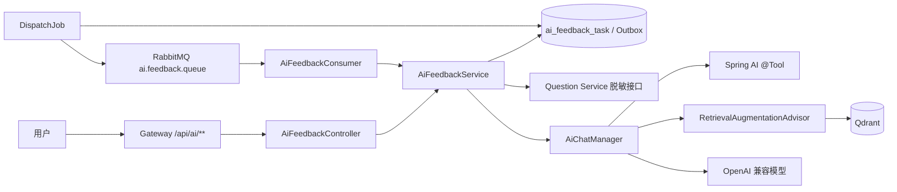

# MyOJ AI Submission Feedback Service

独立的 Spring Boot 3 / Spring AI 微服务。用户手动创建分析任务，服务通过任务表 Outbox 和 RabbitMQ 异步执行；失败提交生成诊断与三级提示，AC 提交生成复杂度和代码质量复盘。

## Architecture



工具调用循环由 Spring AI `ToolCallAdvisor` 负责，服务不自研 ReAct。`userId`、`submissionId` 和当前提交通过 `ToolContext` 提供给工具，不作为工具参数交给模型。

## API

请求统一经过 Gateway，并由 Gateway 写入 `X-user-Id`：

```http
POST /api/ai/feedback
Content-Type: application/json

{"submissionId": 123456}
```

```http
GET /api/ai/feedback/{taskId}
GET /api/ai/feedback/submission/{submissionId}/latest
```

任务状态为：`PENDING`、`DISPATCHING`、`QUEUED`、`RUNNING`、`SUCCESS`、`FAILED`、`TIMEOUT`。响应保持 `{code,data,message}` 格式。

## Required configuration

```dotenv
AI_CHAT_BASE_URL=https://api.openai.com
AI_CHAT_API_KEY=replace-me
AI_CHAT_MODEL=gpt-4o-mini
AI_EMBEDDING_BASE_URL=https://api.openai.com
AI_EMBEDDING_API_KEY=replace-me
AI_EMBEDDING_MODEL=text-embedding-3-small
AI_INTERNAL_TOKEN=replace-with-the-same-random-value-in-question-service
AI_PROMPT_VERSION=v1
AI_KNOWLEDGE_VERSION=v1
AI_KNOWLEDGE_INITIALIZE=true
AI_KNOWLEDGE_EMBEDDING_BATCH_SIZE=10

MYSQL_URL=jdbc:mysql://127.0.0.1:3306/myoj
MYSQL_USERNAME=root
MYSQL_PASSWORD=replace-me
REDIS_HOST=127.0.0.1
RABBITMQ_HOST=127.0.0.1
NACOS_SERVER_ADDR=127.0.0.1:8848
QDRANT_HOST=127.0.0.1
QDRANT_GRPC_PORT=6334
QDRANT_USE_TLS=false
QDRANT_API_KEY=replace-with-the-server-qdrant-api-key
```

`AI_INTERNAL_TOKEN` 必须同时配置给 AI Service 和 Question Service。生产环境不能使用配置文件里的开发默认值。

## Database and knowledge initialization

已有数据库先执行：

```bash
mysql -h 127.0.0.1 -u root -p < sql/migration_20260810_ai_feedback.sql
```

首次创建某个知识库版本时设置 `AI_KNOWLEDGE_INITIALIZE=true`。Spring AI 会先创建 `myoj_knowledge_{version}` collection，随后服务按版本、`docId`、分块序号和内容哈希生成确定性 UUID，幂等写入 `src/main/resources/knowledge` 下的 30 篇知识卡。导入完成后的常规启动应改回 `false`，避免每次启动重复执行导入流程。

知识库版本变化时应同时更新 `AI_KNOWLEDGE_VERSION` 和 Prompt/检索回归测试结果。知识库不得加入题目答案、`judgeCase` 或隐藏输入输出。

## Run and test

```bash
mvn -f myoj-backend-ai-service/pom.xml test
mvn -f myoj-backend-ai-service/pom.xml spring-boot:run
```

如果受限执行环境无法维持 Maven Surefire fork 进程，可用 `-DforkCount=0` 运行同一组离线测试；正常开发机和 CI 保持默认 fork 即可。

健康检查与指标：

```text
GET /api/ai/actuator/health
GET /api/ai/actuator/prometheus
```

关键自定义指标覆盖任务创建/完成、排队耗时、模型耗时、Token、重试次数、RAG 文档数和工具调用次数。Spring AI observation 的内容采集保持关闭，日志不得打印代码、Prompt、工具结果、模型原文或 API Key。

## Security boundary

- 只接受 Gateway 传入的当前用户身份，任务查询再次校验 `userId`。
- Question Service 只返回当前用户终态提交和同题最近三条历史；不返回答案、判题用例或其他用户代码。
- 两个工具均为只读；模型不能指定任意用户或提交，也不能调用代码沙箱。
- 模型输出的行号会按当前代码范围过滤，引用会被实际 RAG 召回文档覆盖，伪造引用不会落库。
- 任务表和 MQ 消息只保存必要元数据；MQ 消息体只有 `taskId`。
