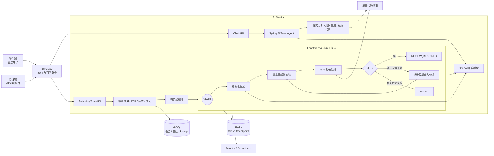
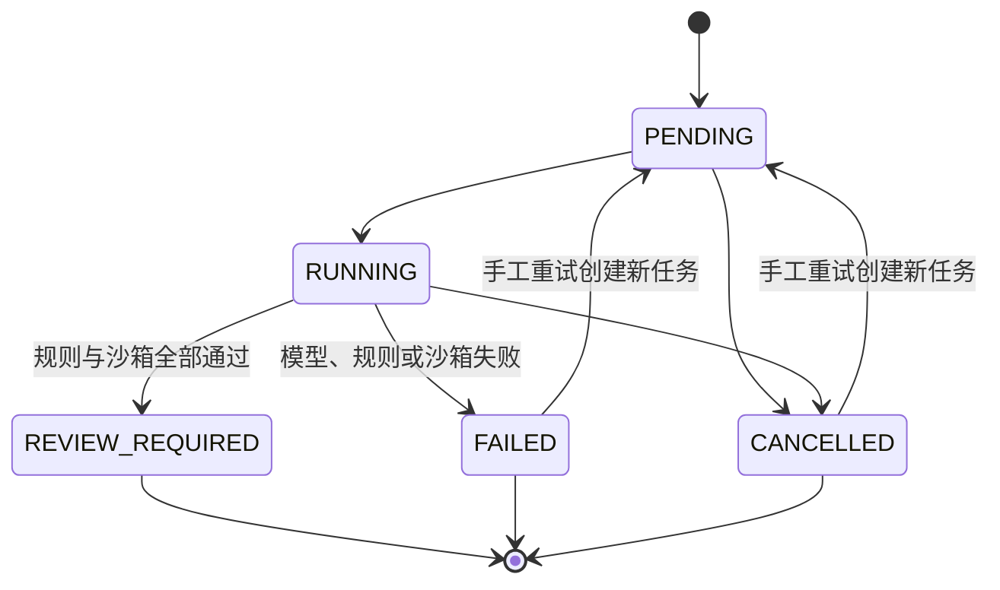

# MyOJ AI Service

MyOJ 的 AI 服务聚焦两个可以完整演示的功能：学生端的多轮算法辅导，以及管理端可恢复、可验证的 AI 出题任务。
项目使用 Spring AI `1.1.7` 调用 OpenAI 兼容模型，使用 LangGraph4j `1.8.24` 编排出题状态机；两者通过普通 Java
接口衔接，没有引入版本不兼容的 `langgraph4j-spring-ai`。

## 架构



首版边界是 Java 标程、单 AI Service 实例、最多三次自动修复、人工审核后发布。不包含 RAG、向量数据库、MQ Worker、
多 Agent、多语言交叉验证或自动发布。

## 管理端：可恢复 AI 出题

任务状态只会按下面的方向流转：



Graph 状态只保存任务 ID、请求、草稿、验证错误、沙箱结果、修复次数与状态，不保存密钥或不断增长的消息历史。每个节点
执行前检查取消标记，并写入当前阶段和进度。`validate` 要求字段完整、6～8 组非空且不重复的用例、Java `Main` 入口和
合法判题配置；`sandbox_verify` 直接调用签名代码沙箱并逐组比对输出，不由模型决定验证结果。

通过验证的草稿只进入 `REVIEW_REQUIRED`。前端把草稿应用到编辑器后，管理员仍需人工检查并使用原有题目接口保存或发布。

### 任务接口

所有请求都经 Gateway 访问。Gateway 校验 JWT 后向 AI Service 注入可信用户身份；浏览器不能自行伪造内部身份头。

```http
POST /api/ai/generation/tasks/problem-drafts
Authorization: Bearer <jwt>
X-Idempotency-Key: draft-array-prefix-sum-001
Content-Type: application/json

{
  "requirements": {
    "topic": "带修改的区间求和",
    "difficulty": 1,
    "tags": ["数组", "线段树"],
    "knowledgePoints": ["懒标记"],
    "constraints": "Java 标程，答案使用 long"
  }
}
```

同一用户使用相同幂等键重复创建时返回原任务，不会重复入队。其余接口：

```http
GET  /api/ai/generation/tasks/{taskId}
GET  /api/ai/generation/tasks?current=1&pageSize=10&type=PROBLEM_DRAFT
POST /api/ai/generation/tasks/{taskId}/cancel
POST /api/ai/generation/tasks/{taskId}/retry
```

手工重试会创建新任务，并用 `sourceTaskId` 指向原任务，原失败记录保留用于审计。任务结果固定为
`result.data.draft + result.data.validation`；验证摘要只包含 Java 沙箱是否通过、用例数和警告。

### Checkpoint 与启动恢复

任务 ID 映射为 LangGraph4j thread ID：`authoring-task-{taskId}`。非测试环境使用 `RedisSaver` 保存 checkpoint；
测试环境使用内存 saver。服务启动时及之后每分钟扫描 `PENDING` 和超过 `AI_AUTHORING_STALE_AFTER` 未更新的 `RUNNING`
任务，从最近 checkpoint 继续执行。首版明确限定单实例，因此没有实现分布式租约。

恢复演示：

1. 创建一个出题任务，并在任务进入 `RUNNING` 后终止 AI Service。
2. 查询 `ai_authoring_task`，确认任务保留当前阶段；Redis 中已有相同 thread ID 的 checkpoint。
3. 重启 AI Service；启动恢复器会重新提交遗留任务。
4. 轮询任务直到 `REVIEW_REQUIRED` 或 `FAILED`；已完成的 Graph 节点不会重复运行。
5. 在管理端打开草稿、人工检查并应用到题目编辑器。

`QuestionAuthoringGraphRedisCheckpointTest` 使用 Testcontainers 模拟“生成节点后中断—从 Redis 恢复”，并断言生成模型只被调用
一次。没有 Docker 时该测试自动跳过。

## 学生端：多轮算法辅导

聊天会话按“用户 + 题目”隔离并持久化。题目工作区会发送题目 ID、当前语言、编辑器代码、最近判题结果和用户问题；流式面板
展示工具执行状态并增量拼接回答，支持重新加载历史与清空会话。

```http
POST /api/ai/chat/session/get
POST /api/ai/chat/session/clear
POST /api/ai/chat/message/send
POST /api/ai/chat/message/stream
Authorization: Bearer <jwt>
Content-Type: application/json
```

消息示例：

```json
{
  "questionId": 1,
  "mode": "agent",
  "message": "为什么这个样例不通过？",
  "language": "java",
  "userCode": "public class Main { ... }",
  "latestJudgeResult": "Wrong Answer",
  "testInputs": ["5\n1 2 3 4 5"]
}
```

流式响应使用 `tool`、`delta`、`meta`、`done`、`error` 事件。Agent 最多执行四步；模型或工具异常会记录失败类型，但日志默认
不包含完整 Prompt、完整代码或模型回答。消息表记录 `traceId`、模型、Prompt 版本、耗时和 token usage，方便问题定位。

## 数据库升级

新环境可直接执行 [`../sql/init_myoj.sql`](../sql/init_myoj.sql)。已有环境按顺序执行：

1. [`../sql/migration_20260819_ai_chat.sql`](../sql/migration_20260819_ai_chat.sql)
2. [`../sql/migration_20260822_ai_authoring_graph.sql`](../sql/migration_20260822_ai_authoring_graph.sql)

第二个迁移新增 `ai_authoring_task`、聊天可观测字段和出题 Prompt；Graph checkpoint 独立保存到 Redis DB 1。

## 配置与部署

生产环境必需：

- `MYSQL_URL`、`MYSQL_USERNAME`、`MYSQL_PASSWORD`
- `AI_CHAT_API_KEY`，以及 `AI_CHAT_BASE_URL`、`AI_CHAT_MODEL`
- `GATEWAY_TRUST_TOKEN`
- `CODESANDBOX_URL`、`CODESANDBOX_SECRET_KEY`
- `REDIS_HOST`、`REDIS_PORT`、`REDIS_PASSWORD`

缺少模型 Key、网关可信令牌、沙箱配置或 Redis 密码时，`prod` 配置会拒绝启动；默认网关令牌同样被禁止。

常用可选配置：

| 环境变量 | 默认值 | 说明 |
|---|---:|---|
| `AI_CHAT_AGENT_MAX_STEPS` | `4` | 辅导 Agent 最大工具循环步数 |
| `AI_CHAT_RETENTION_DAYS` | `30` | 会话保留天数 |
| `AI_AUTHORING_MAX_REPAIR_COUNT` | `3` | 自动修复次数 |
| `AI_AUTHORING_REDIS_DATABASE` | `1` | Graph checkpoint 使用的 Redis DB |
| `AI_AUTHORING_STALE_AFTER` | `3m` | `RUNNING` 任务判定异常中断的时间 |
| `AI_AUTHORING_RECOVERY_CRON` | 每分钟 | 遗留任务扫描周期 |
| `AI_AUTHORING_GRAPH_VERSION` | `authoring-v1` | checkpoint / Graph 版本 |
| `AI_AUTHORING_PROMPT_VERSION` | `authoring-v1` | 默认出题 Prompt 版本 |
| `BAIDU_AI_SEARCH_API_KEY` | 空 | 可选的辅导搜索工具 |

部署继续使用现有 MySQL、Redis、Nacos、Gateway 和代码沙箱。Redis 开启 AOF、使用 `noeviction` 且 checkpoint 默认不设置 TTL；
`deploy/infra/render-local-dev-env.sh` 已包含 AI Service 所需环境变量；
无需新增 Redis Stream、消息队列、向量数据库或其他基础设施。

## 可观测性

Prometheus 指标由 `/actuator/prometheus` 暴露：

- `ai_task_total{status}`
- `ai_graph_node_duration{node,outcome}`
- `ai_model_call_duration{scene,outcome}`
- `ai_tool_call_total{tool,status}`
- `ai_sandbox_validation_total{result}`

任务表同时记录模型、Prompt 版本、Graph 版本、当前阶段、进度、修复次数、开始和结束时间，可与日志中的 task ID / trace ID
联合排查。

## 测试与评测

```bash
cd myoj-backend-ai-service
mvn -q -DforkCount=0 test

cd ../../myoj-frontend
npm test -- --reporter=dot
npm run typecheck
npm run build
```

后端覆盖首次成功、修复后成功、修复仍失败、模型异常、沙箱超时、取消、可信网关身份、幂等、越权、重试和 checkpoint
恢复。前端覆盖任务轮询终止条件、历史恢复、SSE 增量拼接、工具事件、错误状态和路由入口。

固定的 20 条评测输入位于
[`src/test/resources/authoring-evaluation-cases.json`](src/test/resources/authoring-evaluation-cases.json)。自动化测试只校验数据集数量、
唯一性和请求约束；真实模型与真实沙箱评测必须在具有有效凭据的演示环境运行。

本仓库当前没有可公开使用的模型和沙箱凭据，因此不填写结构化解析通过率、沙箱通过率、平均修复次数或 P95 耗时，避免把模拟
结果冒充实测结果。完成实际 20 条评测后，再把同一模型版本、Prompt 版本和 Graph 版本下的真实数据补到这里。
