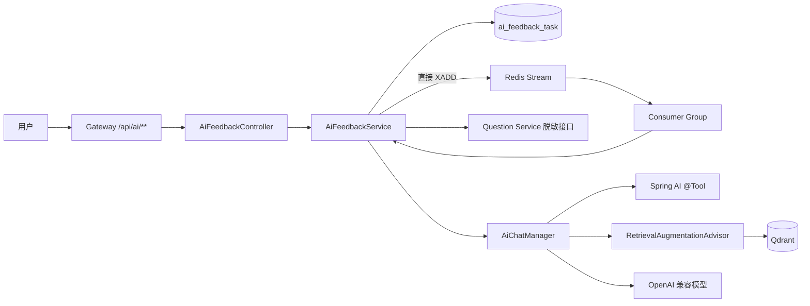
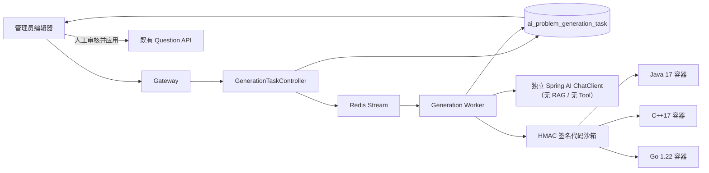

# MyOJ AI Service

独立的 Spring Boot 3 / Spring AI 微服务，包含提交复盘和管理员自动出题两条隔离的业务链路。现有提交复盘行为保持不变；自动出题不使用 RAG，也不调用 Question Service 等业务微服务，只访问代码沙箱做离线验证。

## Architecture



工具调用循环由 Spring AI `ToolCallAdvisor` 负责，服务不自研 ReAct。`userId`、`submissionId` 和当前提交通过 `ToolContext` 提供给工具，不作为工具参数交给模型。

## Problem generation architecture



生成链路先产生题面规格、Java/C++/Go 三份独立参考实现、Java 输入校验器、Java 小数据暴力解和分类测试输入，再在沙箱中完成以下质量门禁：

- 每份程序都实际编译运行；输入校验器必须接受全部输入。
- 三种参考实现对所有用例逐字输出一致。
- 至少三组小数据必须与暴力解输出一致。
- 输入去重并限制单例、总量、源码、答案和输出大小。
- 成功状态是 `REVIEW_REQUIRED`，AI 永远不直接发布题目。管理员应用草稿后仍走 Question Service 原有新增或更新接口，因此不引入跨服务事务。

数据库记录是任务状态的事实来源。请求先写入 `PENDING` 记录再写 Redis Stream；Redis 暂时不可用时恢复任务会补投。消费使用 CAS 领取、实例中断回收、有限重试和执行超时，Stream 消息只携带 `taskId`。

## API

请求统一经过 Gateway，并由 Gateway 写入 `X-user-Id`：

```http
POST /api/ai/feedback
Content-Type: application/json

{"submissionId": 123456}
```

```http
GET /api/ai/feedback/{taskId}
GET /api/ai/feedback/submission/{submissionId}/latest
GET /api/ai/feedback/history?current=1&pageSize=10&submissionId=123456
```

历史接口中的 `submissionId` 可省略；省略时返回当前用户跨提交的全部复盘。任务状态为：`PENDING`、`RUNNING`、`SUCCESS`、`FAILED`、`TIMEOUT`。响应保持 `{code,data,message}` 格式。

自动出题接口仅允许 Gateway 注入的 `X-user-Role: admin` 身份访问：

```http
POST /api/ai/generation/tasks
X-Idempotency-Key: 01927b8e-21a4-7a3b-9d3b-efc683014c50
Content-Type: application/json

{
  "mode": "FULL_PROBLEM",
  "requirements": {
    "topic": "滑动窗口与重复值",
    "difficulty": 1,
    "tags": ["数组", "双指针"],
    "caseCount": 20
  }
}
```

`mode` 也可以是 `TEST_CASES`，此时必须传递当前编辑器的 `sourceDraft`，服务不会读取 Question Service。任务查询与控制接口：

```http
GET  /api/ai/generation/tasks/{taskId}
GET  /api/ai/generation/tasks?current=1&pageSize=10
POST /api/ai/generation/tasks/{taskId}/retry
POST /api/ai/generation/tasks/{taskId}/cancel
```

生成任务状态为 `PENDING`、`RUNNING`、`REVIEW_REQUIRED`、`FAILED`、`TIMED_OUT`、`CANCELLED`。`taskId` 按字符串序列化，避免浏览器丢失 Snowflake 精度。

## Required configuration

```dotenv
AI_CHAT_BASE_URL=https://api.openai.com
AI_CHAT_API_KEY=replace-me
AI_CHAT_MODEL=gpt-4o-mini
AI_EMBEDDING_BASE_URL=https://api.openai.com
AI_EMBEDDING_API_KEY=replace-me
AI_EMBEDDING_MODEL=text-embedding-3-small
AI_INTERNAL_TOKEN=replace-with-the-same-random-value-in-question-service
AI_PROMPT_VERSION=v1
AI_KNOWLEDGE_VERSION=v1
AI_KNOWLEDGE_INITIALIZE=true
AI_KNOWLEDGE_EMBEDDING_BATCH_SIZE=10

# 自动出题（与代码沙箱配置相同的 HMAC 密钥）
CODESANDBOX_URL=http://codesandbox.internal:8090/executeCode
CODESANDBOX_SECRET_KEY=replace-with-a-long-random-secret
AI_GENERATION_PROMPT_VERSION=v1
AI_GENERATION_CONCURRENCY=2
AI_GENERATION_TASK_TIMEOUT_MS=900000
AI_GENERATION_RUNNING_TIMEOUT_MS=1200000
AI_GENERATION_MAX_ATTEMPTS=3
AI_GENERATION_USER_HOURLY_LIMIT=10
AI_GENERATION_GLOBAL_HOURLY_LIMIT=30

MYSQL_URL=jdbc:mysql://127.0.0.1:3306/myoj
MYSQL_USERNAME=root
MYSQL_PASSWORD=replace-me
REDIS_HOST=127.0.0.1
AI_REDIS_STREAM_KEY=myoj:ai:feedback:stream
AI_REDIS_STREAM_GROUP=myoj-ai-feedback
NACOS_SERVER_ADDR=127.0.0.1:8848
QDRANT_HOST=127.0.0.1
QDRANT_GRPC_PORT=6334
QDRANT_USE_TLS=false
QDRANT_API_KEY=replace-with-the-server-qdrant-api-key
```

`AI_INTERNAL_TOKEN` 必须同时配置给 AI Service 和 Question Service。生产环境不能使用配置文件里的开发默认值。

`CODESANDBOX_URL` 应指向内网沙箱地址。自动出题接口与其他业务接口一样通过 Gateway 暴露；Gateway 会覆盖客户端伪造的身份请求头，AI Service 继续校验管理员角色。自动出题代码没有 Feign/Question Service 调用，正式题目写入由浏览器审核后调用原有 Question API 完成。

## Database and knowledge initialization

全新数据库执行：

```bash
mysql -h 127.0.0.1 -u root -p < sql/migration_20260810_ai_feedback.sql
```

已经运行过 RabbitMQ 版本时执行保留历史记录的迁移：

```bash
mysql -h 127.0.0.1 -u root -p < sql/migration_20260811_ai_feedback_redis_stream.sql
```

迁移会保留已有成功、失败、超时任务和合法的结构化结果。旧链路中尚未完成的 `PENDING/DISPATCHING/QUEUED/RUNNING` 任务会转为可手动重试的 `FAILED`，不会再依赖数据库扫描补投。

如果已经执行过早期带 `availableTime`、`idx_status_availableTime` 的 Redis Stream 迁移，不要再次运行上面的全量迁移；停止 AI Service 后只执行增量脚本：

```bash
mysql -h 127.0.0.1 -u root -p < sql/migration_20260811_02_ai_feedback_direct_stream.sql
```

该脚本可重复执行，会保留历史结果，仅移除数据库扫描调度字段并补齐直接 Stream 版本所需索引。

首次创建某个知识库版本时设置 `AI_KNOWLEDGE_INITIALIZE=true`。Spring AI 会先创建 `myoj_knowledge_{version}` collection，随后服务按版本、`docId`、分块序号和内容哈希生成确定性 UUID，幂等写入 `src/main/resources/knowledge` 下的 30 篇知识卡。导入完成后的常规启动应改回 `false`，避免每次启动重复执行导入流程。

知识库版本变化时应同时更新 `AI_KNOWLEDGE_VERSION` 和 Prompt/检索回归测试结果。知识库不得加入题目答案、`judgeCase` 或隐藏输入输出。

自动出题上线前执行新增迁移：

```bash
mysql -h 127.0.0.1 -u root -p < sql/migration_20260813_ai_problem_generation.sql
```

迁移会创建生成任务表，并把 `question.answer`、`question.judgeCase` 扩展为 `MEDIUMTEXT`。应用发布顺序为：数据库迁移 → 代码沙箱 → AI Service → Gateway → 前端。回滚应用版本时保留新增表和扩展后的字段，不需要反向收窄字段。

## Run and test

```bash
mvn -f myoj-backend-ai-service/pom.xml test
mvn -f myoj-backend-ai-service/pom.xml spring-boot:run
```

如果受限执行环境无法维持 Maven Surefire fork 进程，可用 `-DforkCount=0` 运行同一组离线测试；正常开发机和 CI 保持默认 fork 即可。

健康检查与指标：

```text
GET /api/ai/actuator/health
GET /api/ai/actuator/prometheus
```

关键自定义指标覆盖 Redis Stream 入队/消费、生成任务创建/审核/失败、执行耗时和重试原因，以及原复盘链路的模型、Token、RAG 和工具指标。Spring AI observation 的内容采集保持关闭，日志不得打印代码、Prompt、工具结果、模型原文或 API Key。

## Security boundary

- 只接受 Gateway 传入的当前用户身份，任务查询再次校验 `userId`。
- Question Service 只返回当前用户终态提交和同题最近三条历史；不返回答案、判题用例或其他用户代码。
- 两个工具均为只读；模型不能指定任意用户或提交，也不能调用代码沙箱。
- 模型输出的行号会按当前代码范围过滤，引用会被实际 RAG 召回文档覆盖，伪造引用不会落库。
- 任务表是业务记录表，只保存任务状态和用户自己的历史复盘，不承担消息扫描或补投；Redis Stream 消息只包含 `taskId`。
- 自动出题使用不带 Advisor 的独立 `ChatClient`，不访问向量库，也不暴露任何业务工具。
- 自动出题只接受管理员身份，任务按 `userId` 隔离，创建请求强制 UUID 幂等键并执行用户级和全局限流。
- 模型产生的源码和输入一律视为不可信内容，只有通过无网络、只读根文件系统、资源限额容器验证后才进入待审核草稿。
- 待审核草稿不自动调用 Question Service，不自动发布；发布动作仍由管理员在原编辑器明确确认。
