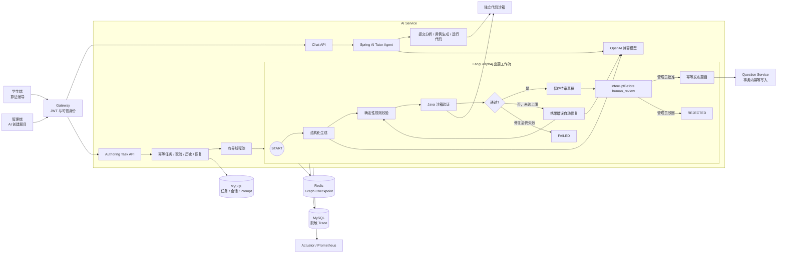
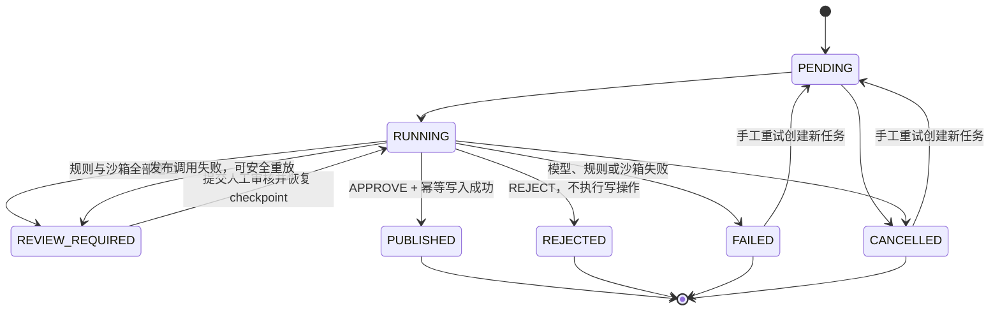

# MyOJ AI Service

MyOJ 的 AI 服务聚焦两个可以完整演示的功能：学生端的多轮算法辅导，以及管理端可恢复、可验证的 AI 出题任务。
项目使用 Spring AI `1.1.7` 调用 OpenAI 兼容模型，使用 LangGraph4j `1.8.24` 编排出题状态机；两者通过普通 Java
接口衔接，没有引入版本不兼容的 `langgraph4j-spring-ai`。

## 架构



首版边界是 Java 标程、单 AI Service 实例、最多三次自动修复，以及必须由管理员审核后才能进入写节点。不包含 RAG、向量数据库、
MQ Worker、多 Agent、多语言交叉验证或无人值守自动发布。

## 管理端：可恢复 AI 出题

任务状态只会按下面的方向流转：



Graph 状态只保存任务 ID、请求、草稿、验证错误、沙箱结果、修复次数与状态，不保存密钥或不断增长的消息历史。每个节点
执行前检查取消标记，并写入当前阶段和进度。`validate` 要求字段完整、6～8 组非空且不重复的用例、Java `Main` 入口和
合法判题配置；`sandbox_verify` 直接调用签名代码沙箱并逐组比对输出，不由模型决定验证结果。

通过验证的草稿先进入 `REVIEW_REQUIRED`，此时 Graph 已在 `human_review` 前持久化中断，题目写客户端调用数必须为 0。前端把草稿
应用到编辑器后，管理员可以修订题面、标题、标签和题解并提交 `APPROVE` 或 `REJECT`；已经通过沙箱的参考代码、测试用例和资源
限制会被锁定，修改它们必须重新生成并验证。服务端把最终草稿、决定、审核人、意见和时间持久化，再使用
`updateState(..., asNode=human_review) + GraphInput.resume()` 恢复同一 thread。只有批准分支能进入 `publish_question`。

发布写操作落在 Question Service 的本地事务中，使用 `ai-authoring-task-{taskId}-publish-v1` 作为幂等键。即使调用超时、进程在写入后
崩溃或 checkpoint 重放，也只会返回原 `questionId`，不会创建第二道题；驳回分支从拓扑上不包含写操作。

### 任务接口

所有请求都经 Gateway 访问。Gateway 校验 JWT 后向 AI Service 注入可信用户身份；浏览器不能自行伪造内部身份头。

```http
POST /api/ai/generation/tasks/problem-drafts
Authorization: Bearer <jwt>
X-Idempotency-Key: draft-array-prefix-sum-001
Content-Type: application/json

{
  "requirements": {
    "topic": "带修改的区间求和",
    "difficulty": 1,
    "tags": ["数组", "线段树"],
    "knowledgePoints": ["懒标记"],
    "constraints": "Java 标程，答案使用 long"
  }
}
```

同一用户使用相同幂等键重复创建时返回原任务，不会重复入队。其余接口：

```http
GET  /api/ai/generation/tasks/{taskId}
GET  /api/ai/generation/tasks/{taskId}/trace
GET  /api/ai/generation/tasks?current=1&pageSize=10&type=PROBLEM_DRAFT
POST /api/ai/generation/tasks/{taskId}/review
POST /api/ai/generation/tasks/{taskId}/cancel
POST /api/ai/generation/tasks/{taskId}/retry
```

人工审核请求示例：

```json
{
  "decision": "APPROVE",
  "comment": "管理员在题目编辑器中复核并批准发布",
  "draft": {
    "title": "人工复核后的标题",
    "difficulty": 1,
    "content": "...",
    "tags": ["数组"],
    "answer": "...",
    "referenceCode": "public class Main { ... }",
    "judgeCase": [{"input": "...", "output": "..."}],
    "judgeConfig": {"timeLimit": 1000, "memoryLimit": 262144, "stackLimit": 262144}
  }
}
```

手工重试会创建新任务，并用 `sourceTaskId` 指向原任务，原失败记录保留用于审计。任务结果固定为
`result.data.draft + result.data.validation`；验证摘要只包含 Java 沙箱是否通过、用例数和警告。

### Checkpoint 与启动恢复

任务 ID 映射为 LangGraph4j thread ID：`authoring-task-{taskId}`。非测试环境使用 `RedisSaver` 保存 checkpoint；
测试环境使用内存 saver。服务启动时及之后每分钟扫描 `PENDING` 和超过 `AI_AUTHORING_STALE_AFTER` 未更新的 `RUNNING`
任务，从最近 checkpoint 继续执行。首版明确限定单实例，因此没有实现分布式租约。

恢复演示：

1. 创建一个出题任务，并在任务进入 `RUNNING` 后终止 AI Service。
2. 查询 `ai_authoring_task`，确认任务保留当前阶段；Redis 中已有相同 thread ID 的 checkpoint。
3. 重启 AI Service；启动恢复器会重新提交遗留任务。
4. 轮询任务直到 `REVIEW_REQUIRED` 或 `FAILED`；已完成的 Graph 节点不会重复运行。
5. 在管理端打开草稿、人工检查并提交审核；服务从 `human_review` checkpoint 恢复到发布或驳回分支。
6. 如发布 HTTP 响应丢失，使用完全相同的审核内容重试；Question Service 返回原题目 ID。

`QuestionAuthoringGraphRedisCheckpointTest` 使用 Testcontainers 模拟“生成节点后中断—从 Redis 恢复”，并断言生成模型只被调用
一次。没有 Docker 时该测试自动跳过。

## 学生端：多轮算法辅导

聊天会话按“用户 + 题目”隔离并持久化。题目工作区会发送题目 ID、当前语言、编辑器代码、最近判题结果和用户问题；流式面板
展示工具执行状态并增量拼接回答，支持重新加载历史与清空会话。

```http
POST /api/ai/chat/session/get
POST /api/ai/chat/session/clear
POST /api/ai/chat/message/send
POST /api/ai/chat/message/stream
Authorization: Bearer <jwt>
Content-Type: application/json
```

消息示例：

```json
{
  "clientMessageId": "8ce28de6-79eb-4ed5-92df-f08f82c78b85",
  "questionId": 1,
  "mode": "agent",
  "message": "为什么这个样例不通过？",
  "language": "java",
  "userCode": "public class Main { ... }",
  "latestJudgeResult": "Wrong Answer",
  "testInputs": ["5\n1 2 3 4 5"]
}
```

`clientMessageId` 由客户端为每次用户发送生成，并在网络重试时复用；服务端用它返回已完成的同一回答。同一会话只允许一个回答生成，
并发的其他请求返回 HTTP 429。

流式响应使用 `tool`、`delta`、`meta`、`done`、`error` 事件。Agent 最多执行四步；模型或工具异常会记录失败类型，但日志默认
不包含完整 Prompt、完整代码或模型回答。消息表记录 `traceId`、模型、Prompt 版本、耗时和 token usage，方便问题定位。

## 数据库升级

新环境可直接执行 [`../sql/init_myoj.sql`](../sql/init_myoj.sql)。已有环境按顺序执行：

1. [`../sql/migration_20260819_ai_chat.sql`](../sql/migration_20260819_ai_chat.sql)
2. [`../sql/migration_20260822_ai_authoring_graph.sql`](../sql/migration_20260822_ai_authoring_graph.sql)
3. [`../sql/migration_20260830_ai_chat_concurrency.sql`](../sql/migration_20260830_ai_chat_concurrency.sql)
4. [`../sql/migration_20260831_ai_authoring_hitl_publish.sql`](../sql/migration_20260831_ai_authoring_hitl_publish.sql)

这些迁移新增 `ai_authoring_task`、聊天可观测字段、跨实例会话单飞、清空版本栅栏、工具原子额度和出题 Prompt；最后一个迁移增加
审核审计字段、Question Service 幂等发布表及脱敏 Graph trace 表。Graph checkpoint 独立保存到 Redis DB 1。
部署时必须同步把 `AI_AUTHORING_GRAPH_VERSION` 切到 `authoring-v2-hitl`；升级前遗留的 `authoring-v1` 待审任务不能套用新拓扑恢复，
应从任务历史点击重试生成 v2 任务。

## 配置与部署

生产环境必需：

- `MYSQL_URL`、`MYSQL_USERNAME`、`MYSQL_PASSWORD`
- `AI_CHAT_API_KEY`，以及 `AI_CHAT_BASE_URL`、`AI_CHAT_MODEL`
- `GATEWAY_TRUST_TOKEN`
- `CODESANDBOX_URL`、`CODESANDBOX_SECRET_KEY`
- `REDIS_HOST`、`REDIS_PORT`、`REDIS_PASSWORD`

缺少模型 Key、网关可信令牌、沙箱配置或 Redis 密码时，`prod` 配置会拒绝启动；默认网关令牌同样被禁止。

常用可选配置：

| 环境变量 | 默认值 | 说明 |
|---|---:|---|
| `AI_CHAT_AGENT_MAX_STEPS` | `4` | 辅导 Agent 最大工具循环步数 |
| `AI_CHAT_RETENTION_DAYS` | `30` | 会话保留天数 |
| `AI_CHAT_CORE_THREADS` | `8` | 学生辅导独立线程池常驻线程数 |
| `AI_CHAT_MAX_THREADS` | `8` | 学生辅导独立线程池最大线程数 |
| `AI_CHAT_QUEUE_CAPACITY` | `32` | 学生辅导有界等待队列；满载后拒绝新请求 |
| `AI_AUTHORING_MAX_REPAIR_COUNT` | `3` | 自动修复次数 |
| `AI_AUTHORING_REDIS_DATABASE` | `1` | Graph checkpoint 使用的 Redis DB |
| `AI_AUTHORING_STALE_AFTER` | `3m` | `RUNNING` 任务判定异常中断的时间 |
| `AI_AUTHORING_RECOVERY_CRON` | 每分钟 | 遗留任务扫描周期 |
| `AI_AUTHORING_GRAPH_VERSION` | `authoring-v2-hitl` | checkpoint / Graph 版本 |
| `AI_AUTHORING_PROMPT_VERSION` | `authoring-v1` | 默认出题 Prompt 版本 |
| `BAIDU_AI_SEARCH_API_KEY` | 空 | 可选的辅导搜索工具 |

部署继续使用现有 MySQL、Redis、Nacos、Gateway 和代码沙箱。Redis 开启 AOF、使用 `noeviction` 且 checkpoint 默认不设置 TTL；
`deploy/infra/render-local-dev-env.sh` 已包含 AI Service 所需环境变量；
无需新增 Redis Stream、消息队列、向量数据库或其他基础设施。

## 可观测性

Prometheus 指标由 `/actuator/prometheus` 暴露：

- `ai_task_total{status}`
- `ai_graph_node_duration{node,outcome}`
- `ai_model_call_duration{scene,outcome}`
- `ai_tool_call_total{tool,status}`
- `ai_sandbox_validation_total{result}`

任务表同时记录模型、Prompt/Graph 版本、阶段、修复次数、审核决定、审核人、最终草稿和发布题目 ID。`ai_authoring_trace_event` 以
稳定 `traceId=authoring-task-{taskId}` 串起首次执行、故障恢复和人工审核 run，覆盖 node、edge、LLM、tool、checkpoint、approval 和
write；LLM 事件包含 prompt/completion/total tokens。Trace 只保存内容 SHA-256 和聚合元数据，不保存完整 Prompt、题面、答案、
测试用例或参考代码。详细契约和门禁见 [`../docs/ai-authoring-hitl-trace-gates.md`](../docs/ai-authoring-hitl-trace-gates.md)。

## 测试与评测

```bash
cd myoj-backend-ai-service
mvn -q test

cd ../../myoj-frontend
npm test -- --reporter=dot
npm run typecheck
npm run build
```

后端覆盖首次成功、修复后成功、修复仍失败、模型异常、沙箱超时、取消、可信网关身份、幂等、越权、重试和 checkpoint
恢复。前端覆盖任务轮询终止条件、历史恢复、SSE 增量拼接、工具事件、错误状态和路由入口。

固定的 20 条生成评测输入和 4 条工作流场景位于
[`src/test/resources/authoring-evaluation-cases.json`](src/test/resources/authoring-evaluation-cases.json)，同时版本化记录允许/禁止工具、
期望路径、最大步数、成本/延迟预算和安全约束。单测覆盖审批前零写入、批准发布、驳回零写入、发布幂等回放和 checkpoint 恢复；
真实模型与真实沙箱的成功率、P95 延迟和 token 门禁必须在具有有效凭据的预发布环境运行。

本仓库当前没有可公开使用的模型和沙箱凭据，因此不填写结构化解析通过率、沙箱通过率、平均修复次数或 P95 耗时，避免把模拟
结果冒充实测结果。完成实际 20 条评测后，再把同一模型版本、Prompt 版本和 Graph 版本下的真实数据补到这里。
